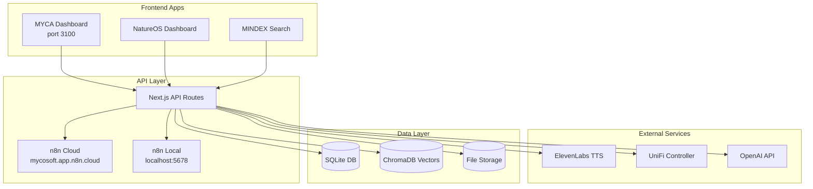

# MYCOSOFT MAS Full System Implementation Plan

## Phase 1: MYCA Dashboard Fixes (Priority)

### 1.1 Fix Agent Creation Error

The agent creator at `unifi-dashboard/src/components/AgentCreator.tsx` line 124 tries to POST to `http://localhost:8001/agents/registry/create` which doesn't exist.

**Fix**: Create a working API endpoint at `/api/agents/create` in the main app:

```typescript
// app/api/agents/create/route.ts
export async function POST(request: NextRequest) {
  const agent = await request.json();
  // Save to agents_registry.yaml or JSON file
  // Return created agent
}
```

### 1.2 Fix Search Functionality

The search bar component needs to actually query agents, services, and databases.

**Files to modify**:

- `unifi-dashboard/src/components/SearchBar.tsx` - Add actual search logic
- Create `/api/search` endpoint that queries across entities

### 1.3 Replace Mock Data with Real Data

Current dashboard uses hardcoded mock data. Need to connect to real APIs:

**Data sources to integrate**:

- Agent registry: `/api/agents/registry`
- Network status: Docker container status via Docker API
- System metrics: Use `systeminformation` npm package
- n8n workflow status: Query n8n API

### 1.4 Fix Non-Working Buttons

Review all click handlers in `unifi-dashboard/src/components/Dashboard.tsx` and ensure they trigger real actions.

---

## Phase 2: ElevenLabs Voice Integration

### 2.1 Check/Configure ElevenLabs API Key

The TTS route at `unifi-dashboard/src/app/api/myca/tts/route.ts` needs `ELEVENLABS_API_KEY` environment variable.

**Action**:

- Create `.env.local` in unifi-dashboard with:
```
ELEVENLABS_API_KEY=your_key_here
ELEVENLABS_VOICE_ID=aEO01A4wXwd1O8GPgGlF
```


### 2.2 ElevenLabs ConvAI Widget

The `ElevenLabsWidget.tsx` component exists but needs the ConvAI agent ID configured:

- Agent ID: `agent_2901kcpp3bk2fcjshrajb9fxvv3y` (from convai/route.ts)

---

## Phase 3: n8n Hybrid Integration

### 3.1 Configure n8n Cloud Connection

Create service to connect to `mycosoft.app.n8n.cloud`:

```typescript
// lib/n8n-client.ts
const N8N_CLOUD_URL = "https://mycosoft.app.n8n.cloud";
const N8N_LOCAL_URL = "http://localhost:5678";
```

### 3.2 Create Workflows Dashboard View

New component at `app/natureos/workflows/page.tsx`:

- List all workflows from both cloud and local n8n
- Show execution status
- Allow triggering workflows
- Display execution logs

---

## Phase 4: NatureOS Routes

### 4.1 /natureos/workflows

Embed n8n workflow list with controls to manage workflows.

### 4.2 /natureos/shell

Real terminal using xterm.js with WebSocket backend:

- Create `/api/terminal` WebSocket endpoint
- Use node-pty for actual shell access
- Security: localhost only, require auth

### 4.3 /natureos/api

API Explorer using Swagger/OpenAPI:

- Auto-generate from all `/api/*` routes
- Interactive testing interface

### 4.4 /natureos/devices

Mirror UniFi-style device dashboard:

- Use existing `unifi-dashboard` components
- Connect to real device APIs (UniFi Controller if available)

### 4.5 /natureos/storage

NAS/Storage dashboard:

- File browser for configured paths
- Storage usage metrics
- Cloud storage integration (if configured)

### 4.6 /natureos/monitoring

System monitoring dashboard:

- Docker container status
- Service health checks
- Log aggregation
- n8n workflow metrics

### 4.7 /natureos/integrations

Integration management hub:

- List all configured integrations (n8n, Zapier, IFTTT, ElevenLabs, etc.)
- Add/remove/configure integrations
- Test connectivity
- Manage API keys (securely)

---

## Phase 5: MINDEX Data Pipeline

### 5.1 Data Scraping System

Create Python scrapers for:

- iNaturalist API (fungi observations)
- FungiDB (genomic data)
- MycoBank (taxonomy)
- GBIF (occurrence data)

### 5.2 Local Database

- Use SQLite for structured data
- Vector store (ChromaDB) for semantic search
- File storage for documents/images

### 5.3 Continuous Sync

n8n workflow to periodically:

- Fetch new data from sources
- Process and format
- Store locally
- Update search index

---

## Phase 6: Apps and Ancestry

### 6.1 Spore Tracker Map

- Integrate Azure Maps or Google Maps API
- Overlay mycology observation data
- Real-time updates from MycoBrain sensors

### 6.2 Ancestry Tools

- Create widget components for each tool
- Make them draggable/resizable
- Store layout preferences

### 6.3 More Apps

- Create app registry system
- Each app as a widget that can be added to dashboard

---

## Architecture Diagram



---

## Implementation Order

1. **Immediate** (Phase 1-2): Fix MYCA Dashboard + ElevenLabs voice
2. **Week 1**: n8n hybrid integration, NatureOS routes skeleton
3. **Week 2**: MINDEX data pipeline, real data integration
4. **Week 3**: Apps, Ancestry, polish all features