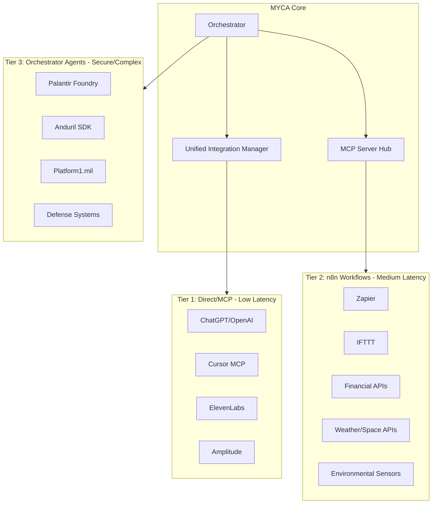

# Global Service Integration for Mycosoft MAS

## Architecture Overview

The integration will use a tiered approach based on latency, security, and complexity requirements:



---

## Phase 1: Integration Registry Expansion

Extend [n8n/registry/integration_registry.json](n8n/registry/integration_registry.json) with new categories:

### New Categories to Add

- `space_weather` - NASA, NOAA, SOHO, STEREO, solar activity
- `environmental` - Air quality, pollution, radiation, CO2, VOC sensors
- `earth_science` - Earthquakes, tides, floods, buoys, levees, ports
- `analytics` - Amplitude, Mixpanel, Segment, data analysis tools
- `automation` - Zapier, IFTTT, Make.com connectors
- `defense` - Palantir, Anduril, Platform One (restricted)

### Key Integrations per Category

**Space/Weather (15+ APIs)**

- NASA Open APIs (DONKI, EPIC, Mars Rover, Astronomy POD)
- NOAA APIs (Weather, Space Weather, Tides, Buoys)
- SOHO/STEREO solar data
- Solar Dynamics Observatory
- GOES satellite data

**Environmental (20+ APIs)**

- OpenAQ (air quality)
- EPA AirNow
- PurpleAir sensors
- IQAir
- Radiation monitoring (EPA RadNet, Safecast)
- CO2/VOC sensors (custom MQTT/HTTP)

**Earth Science (15+ APIs)**

- USGS Earthquake API
- NOAA Tides & Currents
- USACE levee/dam data
- Port/harbor AIS data
- NDBC buoy data

**Financial (10+ APIs)**

- CoinMarketCap (crypto)
- Alpha Vantage (stocks)
- Polygon.io (market data)
- Robinhood API (unofficial)
- Plaid (banking)

---

## Phase 2: n8n Workflow Creation

Create new n8n workflows in [n8n/workflows/](n8n/workflows/):

### New Workflow Files

1. `11_native_space_weather.json` - NASA, NOAA space weather, solar activity
2. `12_native_environmental.json` - Air quality, pollution, radiation
3. `15_native_earth_science.json` - Earthquakes, tides, buoys
4. `16_native_analytics.json` - Amplitude, data analysis
5. `17_native_automation.json` - Zapier, IFTTT webhooks
6. `30_defense_connector.json` - Palantir, Anduril (restricted)

### Workflow Pattern (from existing)

Each workflow follows the pattern in `07_native_finance.json`:

- Execute Workflow Trigger
- Router based on integration name
- Switch to specific API nodes
- Format Response
- Return to dispatcher

---

## Phase 3: Python Integration Clients

Extend [mycosoft_mas/integrations/](mycosoft_mas/integrations/) with new clients:

### New Client Files

1. `space_weather_client.py` - NASA/NOAA space weather APIs
2. `environmental_client.py` - Air quality, pollution sensors
3. `earth_science_client.py` - USGS, tides, buoys
4. `financial_markets_client.py` - CoinMarketCap, stocks
5. `automation_hub_client.py` - Zapier, IFTTT webhooks
6. `defense_client.py` - Palantir, Anduril (secure)

### Update Unified Manager

Add new clients to [mycosoft_mas/integrations/unified_integration_manager.py](mycosoft_mas/integrations/unified_integration_manager.py)

---

## Phase 4: MCP Server Configuration

Expand [mycosoft_mas/config/mcp_servers.yaml](mycosoft_mas/config/mcp_servers.yaml):

### New MCP Server Entries

```yaml
servers:
  cursor_mcp:
    name: "Cursor IDE MCP"
    capabilities: [code_edit, file_ops, terminal]
  
  chatgpt_mcp:
    name: "ChatGPT Plugins"
    capabilities: [conversation, code_gen, analysis]
  
  environmental_mcp:
    name: "Environmental Data MCP"
    capabilities: [sensor_data, alerts, monitoring]
  
  space_mcp:
    name: "Space Weather MCP"
    capabilities: [solar_events, satellite_data, predictions]
```

---

## Phase 5: API Routes

Create Next.js API routes in [app/api/mas/](app/api/mas/):

### New Route Files

- `app/api/mas/space-weather/route.ts` - Space/weather data
- `app/api/mas/environmental/route.ts` - Environmental sensors
- `app/api/mas/financial/route.ts` - Market data
- `app/api/mas/earth-science/route.ts` - Earthquake, tides

---

## Phase 6: Environment Configuration

Create comprehensive `.env` template with all API keys:

### Required API Keys (Priority)

- `NASA_API_KEY` - api.nasa.gov
- `NOAA_TOKEN` - api.weather.gov
- `OPENAQ_API_KEY` - openaq.org
- `COINMARKETCAP_API_KEY` - coinmarketcap.com
- `ALPHA_VANTAGE_KEY` - alphavantage.co
- `AMPLITUDE_API_KEY` - amplitude.com
- `ZAPIER_WEBHOOK_URL` - zapier.com
- `IFTTT_WEBHOOK_KEY` - ifttt.com

### Defense/Restricted (Phase 2)

- `PALANTIR_API_KEY`
- `ANDURIL_SDK_KEY`
- `PLATFORM_ONE_TOKEN`

---

## Implementation Priority

1. **Immediate (Free/Easy APIs)**

   - NASA Open APIs (free, no key required for some)
   - USGS Earthquake API (free)
   - NOAA Weather/Tides (free)
   - OpenAQ (free tier)

2. **Short-term (API key required)**

   - CoinMarketCap
   - Amplitude
   - Zapier webhooks
   - IFTTT

3. **Medium-term (Complex setup)**

   - Robinhood (unofficial API)
   - Custom sensor integrations
   - Port/harbor data

4. **Long-term (Restricted access)**

   - Palantir Foundry
   - Anduril SDK
   - Platform One

---

## File Structure Summary

```
n8n/
├── registry/
│   └── integration_registry.json  # Extended with 60+ new integrations
└── workflows/
    ├── 11_native_space_weather.json
    ├── 12_native_environmental.json
    ├── 15_native_earth_science.json
    ├── 16_native_analytics.json
    ├── 17_native_automation.json
    └── 30_defense_connector.json

mycosoft_mas/
├── config/
│   └── mcp_servers.yaml  # Extended with new MCP servers
└── integrations/
    ├── space_weather_client.py
    ├── environmental_client.py
    ├── earth_science_client.py
    ├── financial_markets_client.py
    ├── automation_hub_client.py
    └── defense_client.py

app/api/mas/
├── space-weather/route.ts
├── environmental/route.ts
├── financial/route.ts
└── earth-science/route.ts
```