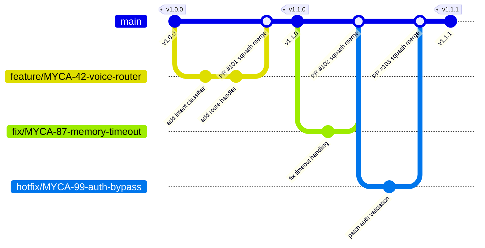

# Branching Strategy

**Date:** February 9, 2026
**Applies to:** All Mycosoft repositories (MAS, Website, MINDEX, MycoBrain, NatureOS, Mycorrhizae, NLM, SDK, platform-infra)

---

## Overview

Mycosoft follows **trunk-based development** with short-lived feature branches. The `main` branch is the single source of truth and must always be in a deployable state. All changes flow through pull requests with mandatory CI checks and code review.

---

## Branch Naming Conventions

| Prefix | Purpose | Example |
|--------|---------|---------|
| `feature/` | New feature or capability | `feature/MYCA-42-voice-intent-router` |
| `fix/` | Bug fix | `fix/MYCA-87-memory-api-timeout` |
| `hotfix/` | Urgent production fix | `hotfix/MYCA-99-auth-bypass` |
| `docs/` | Documentation only | `docs/update-api-catalog` |
| `refactor/` | Code refactoring (no behavior change) | `refactor/memory-module-cleanup` |
| `test/` | Test additions or changes | `test/add-orchestrator-integration` |
| `ci/` | CI/CD pipeline changes | `ci/add-playwright-workflow` |
| `myca-coding-*` | MYCA autonomous coding branches | `myca-coding-1739088000` |

**Rules:**
- Use lowercase with hyphens (no underscores or spaces)
- Include ticket ID when applicable (e.g., `MYCA-42`)
- Keep descriptions short but meaningful
- Branch names must not exceed 100 characters

---

## Branching Flow



---

## Pull Request Requirements

### Mandatory for All PRs to `main`

1. **CI must pass** -- All automated checks (lint, type check, tests, build) must be green
2. **At least 1 reviewer** must approve (2 for security or architecture changes)
3. **No direct commits to `main`** -- All changes go through PRs
4. **Squash merge preferred** -- Keeps `main` history clean with one commit per PR
5. **Branch must be up to date** with `main` before merge
6. **PR description** must explain what changed and why

### PR Template

```markdown
## Summary
<!-- 1-3 bullet points describing the change -->

## Type
- [ ] Feature
- [ ] Bug fix
- [ ] Hotfix
- [ ] Refactor
- [ ] Documentation
- [ ] CI/CD

## Checklist
- [ ] Tests added/updated
- [ ] Documentation updated
- [ ] Registries updated (if adding agents/APIs/services)
- [ ] No hardcoded secrets or API keys
- [ ] CI passes
```

---

## Branch Lifecycle

### Feature Branches

1. Create from `main`: `git checkout -b feature/MYCA-42-description main`
2. Keep short-lived (ideally < 3 days, max 1 week)
3. Rebase on `main` regularly to avoid drift: `git rebase main`
4. Open PR when ready for review
5. Squash merge into `main` after approval
6. Branch is auto-deleted after merge

### Hotfix Branches

1. Create from `main`: `git checkout -b hotfix/MYCA-99-description main`
2. Fix the issue with minimal changes
3. Open PR with `hotfix` label -- expedited review (respond within 4 hours)
4. Squash merge into `main`
5. Tag a patch release immediately: `v{major}.{minor}.{patch+1}`
6. Deploy to affected VMs immediately

---

## Release Tagging

Mycosoft uses **Semantic Versioning (semver)**: `v{major}.{minor}.{patch}`

| Version Bump | When | Example |
|-------------|------|---------|
| **Major** (`v2.0.0`) | Breaking API changes, major architecture shifts | New memory system, API v2 |
| **Minor** (`v1.1.0`) | New features, non-breaking additions | New agent, new API endpoint |
| **Patch** (`v1.0.1`) | Bug fixes, hotfixes, documentation | Fix timeout, fix typo |

### Tagging Process

```bash
# After merging to main
git checkout main
git pull origin main
git tag -a v1.2.0 -m "Release v1.2.0: Add voice intent router, fix memory timeout"
git push origin v1.2.0
```

### Per-Repo Versioning

Each repo maintains its own version tags independently:
- **MAS**: `v1.x.x` -- Multi-Agent System
- **Website**: `v1.x.x` -- Next.js website
- **MINDEX**: `v1.x.x` -- Database and ETL
- **MycoBrain**: `v1.x.x` -- Firmware
- **NatureOS**: `v1.x.x` -- .NET platform

---

## MYCA Autonomous Coding Branches

When MYCA (the AI coding agent) makes changes, it follows the safety rules in `CLAUDE.md`:

1. Always creates a branch: `myca-coding-{timestamp}`
2. Makes changes and runs tests
3. Opens a PR for human review
4. Never merges without human approval
5. Never pushes directly to `main`

---

## Protected Branch Rules (GitHub)

### `main` Branch Protection

- Require pull request before merging
- Require at least 1 approval
- Dismiss stale reviews when new commits are pushed
- Require status checks to pass (CI workflow)
- Require branches to be up to date before merging
- Do not allow bypassing the above settings
- Restrict who can push (admin only as escape hatch)

---

## Summary

| Rule | Policy |
|------|--------|
| Default branch | `main` |
| Development model | Trunk-based with short-lived branches |
| Merge strategy | Squash merge (preferred) |
| Direct commits to `main` | Prohibited |
| PR required | Yes, always |
| Minimum reviewers | 1 (2 for security/architecture) |
| CI must pass | Yes, mandatory |
| Branch max lifetime | 1 week (hotfixes < 1 day) |
| Release versioning | Semver (`v{major}.{minor}.{patch}`) |
| Branch auto-delete | Yes, after merge |
