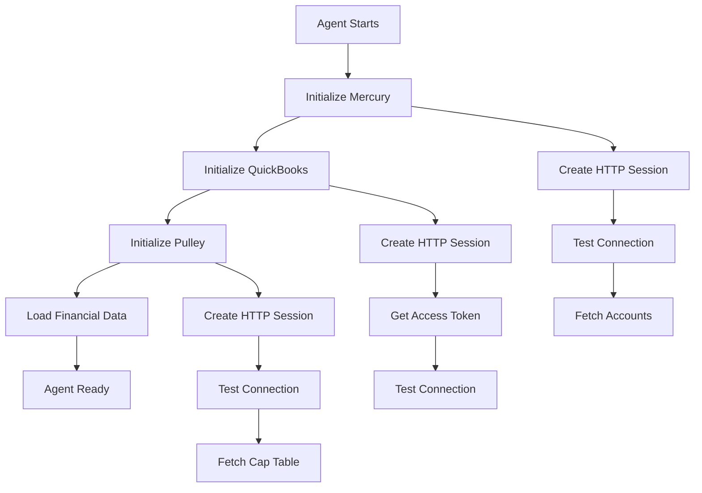

# Financial API Integrations Setup Guide

**Date:** February 12, 2026  
**Status:** Production Ready  
**Agent:** Financial Operations Agent  
**Location:** `mycosoft_mas/agents/financial/financial_operations_agent.py`

## Overview

The Financial Operations Agent integrates with three real financial service APIs:

1. **Mercury Banking API** - Banking operations, balances, transactions, payments
2. **QuickBooks Online API** - Accounting, invoices, expenses, financial reports
3. **Pulley API** - Cap table management, equity tracking, vesting schedules

All integrations use **real API clients** with proper authentication, error handling, and no mock data.

---

## 1. Mercury Banking API

### API Documentation
- **Website:** https://mercury.com
- **API Docs:** https://docs.mercury.com/
- **Base URL:** `https://api.mercury.com`

### Setup Steps

#### 1.1 Create Mercury Account
1. Sign up at https://mercury.com
2. Complete business verification
3. Fund your account

#### 1.2 Generate API Key
1. Log in to Mercury Dashboard
2. Navigate to **Settings** > **API Keys**
3. Click **Create API Key**
4. Copy the API key (you won't see it again)

#### 1.3 Configure Environment Variables

In `.env` or system environment:

```bash
MERCURY_API_KEY=your_api_key_here
MERCURY_API_BASE_URL=https://api.mercury.com  # Optional, defaults to this
```

### Features Implemented

- **Account Balance Queries** - Get real-time available and current balances
- **Transaction Lists** - Fetch transactions with date filtering and pagination
- **Internal Transfers** - Move money between Mercury accounts
- **ACH Payments** - Send payments to external accounts
- **Wire Transfers** - Initiate domestic and international wires

### Example Usage

```python
# Get account balance
balance = await financial_agent.get_mercury_account_balance("acc_123")
print(f"Available: ${balance['available_balance'] / 100}")

# Get recent transactions
transactions = await financial_agent.get_mercury_transactions(
    account_id="acc_123",
    start_date="2026-01-01",
    end_date="2026-02-12",
    limit=50
)

# Process a payment
transaction = {
    "type": "payment",
    "amount": 50000,  # $500.00 in cents
    "from_account": "acc_123",
    "to_account": "external_recipient_id",
    "description": "Invoice payment"
}
transaction_id = await financial_agent.process_transaction(transaction)
```

### API Rate Limits
- **Standard:** 100 requests per minute
- **Burst:** 300 requests per minute (short duration)

### Error Handling
- `401` - Invalid API key
- `403` - Insufficient permissions
- `404` - Account or transaction not found
- `422` - Invalid request parameters
- `429` - Rate limit exceeded

---

## 2. QuickBooks Online API

### API Documentation
- **Website:** https://quickbooks.intuit.com
- **Developer Portal:** https://developer.intuit.com
- **API Docs:** https://developer.intuit.com/app/developer/qbo/docs/api/accounting/
- **Base URL (Production):** `https://quickbooks.api.intuit.com`
- **Base URL (Sandbox):** `https://sandbox-quickbooks.api.intuit.com`

### Setup Steps

#### 2.1 Create Intuit Developer Account
1. Sign up at https://developer.intuit.com
2. Verify your email
3. Accept developer terms

#### 2.2 Create an App
1. Go to **My Apps** in developer dashboard
2. Click **Create an App**
3. Select **QuickBooks Online API**
4. Fill in app details
5. Note your **Client ID** and **Client Secret**

#### 2.3 Configure OAuth 2.0
1. Set **Redirect URI** in app settings (e.g., `https://localhost:8001/oauth/callback`)
2. Select scopes: `com.intuit.quickbooks.accounting`
3. Note your **Realm ID** (Company ID) from QuickBooks account

#### 2.4 Get Refresh Token

You need to implement OAuth 2.0 flow to get initial tokens:

```python
# Step 1: Authorization URL (user visits this in browser)
auth_url = (
    "https://appcenter.intuit.com/connect/oauth2"
    f"?client_id={client_id}"
    f"&response_type=code"
    f"&scope=com.intuit.quickbooks.accounting"
    f"&redirect_uri={redirect_uri}"
    f"&state=random_state_string"
)

# Step 2: User authorizes, you receive auth code at redirect_uri

# Step 3: Exchange auth code for tokens
import aiohttp
token_url = "https://oauth.platform.intuit.com/oauth2/v1/tokens/bearer"
data = {
    "grant_type": "authorization_code",
    "code": auth_code,
    "redirect_uri": redirect_uri,
    "client_id": client_id,
    "client_secret": client_secret
}
async with aiohttp.ClientSession() as session:
    async with session.post(token_url, data=data) as response:
        tokens = await response.json()
        refresh_token = tokens["refresh_token"]  # Save this!
```

#### 2.5 Configure Environment Variables

In `.env` or system environment:

```bash
QUICKBOOKS_CLIENT_ID=your_client_id
QUICKBOOKS_CLIENT_SECRET=your_client_secret
QUICKBOOKS_REALM_ID=your_company_id
QUICKBOOKS_REFRESH_TOKEN=your_refresh_token
QUICKBOOKS_ENVIRONMENT=production  # or 'sandbox' for testing
```

### Features Implemented

- **Automatic Token Refresh** - OAuth 2.0 tokens refreshed automatically
- **Transaction Recording** - Record transfers, payments, and purchases
- **Invoice Creation** - Create and send customer invoices
- **Expense Tracking** - Track business expenses
- **Financial Reports** - Generate P&L, Balance Sheet, Cash Flow reports
- **Account Management** - List and query chart of accounts

### Example Usage

```python
# Record a transaction
transaction = {
    "type": "transfer",
    "amount": 100000,  # $1000.00 in cents
    "from_account": "qb_account_1",
    "to_account": "qb_account_2",
    "description": "Monthly transfer"
}
await financial_agent.process_transaction(transaction)

# Create an invoice
invoice_id = await financial_agent.create_quickbooks_invoice(
    customer_id="123",
    line_items=[
        {
            "Amount": 500.00,
            "Description": "Consulting services",
            "DetailType": "SalesItemLineDetail",
            "SalesItemLineDetail": {
                "ItemRef": {"value": "1"}
            }
        }
    ],
    due_date="2026-03-15",
    memo="February consulting"
)

# Generate financial report
report = await financial_agent.get_quickbooks_financial_report(
    report_type="ProfitAndLoss",
    start_date="2026-01-01",
    end_date="2026-01-31"
)
```

### API Rate Limits
- **QuickBooks Online:** 500 requests per minute per company
- **Batch Operations:** 30 operations per batch
- **Tokens:** Access tokens expire after 1 hour, refresh tokens valid for 100 days

### Error Handling
- `401` - Invalid or expired access token (triggers automatic refresh)
- `403` - Insufficient permissions for operation
- `400` - Invalid request format
- `429` - Rate limit exceeded

### Token Management
The agent automatically:
- Checks token expiration before each request
- Refreshes tokens when they're about to expire (within 5 minutes)
- Updates stored refresh tokens when new ones are issued

---

## 3. Pulley Cap Table API

### API Documentation
- **Website:** https://pulley.com
- **API Docs:** https://docs.pulley.com/
- **Base URL:** `https://api.pulley.com`

### Setup Steps

#### 3.1 Create Pulley Account
1. Sign up at https://pulley.com
2. Complete company onboarding
3. Set up your initial cap table

#### 3.2 Generate API Key
1. Log in to Pulley Dashboard
2. Navigate to **Settings** > **API**
3. Click **Generate API Key**
4. Copy the API key

#### 3.3 Configure Environment Variables

In `.env` or system environment:

```bash
PULLEY_API_KEY=your_api_key_here
PULLEY_API_BASE_URL=https://api.pulley.com  # Optional, defaults to this
```

### Features Implemented

- **Cap Table Queries** - Get current ownership structure
- **Stakeholder Management** - Add/update investors and employees
- **SAFE Note Tracking** - Record SAFE agreements
- **Option Grants** - Issue employee stock options
- **Vesting Schedules** - Query vesting status for stakeholders
- **Stock Issuance** - Record equity issuances
- **Cap Table Snapshots** - Get ownership percentages and valuations

### Example Usage

```python
# Create a SAFE agreement
safe_details = {
    "investor": "Investor Name",
    "investor_id": "stakeholder_123",
    "amount": 250000,  # $250,000
    "valuation_cap": 10000000,  # $10M cap
    "discount": 20,  # 20% discount
    "terms": "Standard SAFE with MFN",
    "issue_date": "2026-02-12"
}
agreement_id = await financial_agent.create_safe_agreement(safe_details)

# Issue option grant
update = {
    "type": "option_grant",
    "effective_date": "2026-02-12",
    "details": {
        "stakeholder_id": "employee_456",
        "quantity": 50000,  # 50,000 options
        "exercise_price": 1.50,
        "vesting_schedule_id": "4yr_1yr_cliff"
    }
}
await financial_agent.update_cap_table(update)

# Get vesting schedule
vesting = await financial_agent.get_pulley_vesting_schedule("employee_456")
print(f"Vested: {vesting['vested_shares']}, Unvested: {vesting['unvested_shares']}")

# Get cap table snapshot
snapshot = await financial_agent.get_pulley_cap_table_snapshot()
print(f"Total shares: {snapshot['total_shares_outstanding']}")
print(f"Fully diluted: {snapshot['fully_diluted_shares']}")
```

### API Rate Limits
- **Standard:** 60 requests per minute
- **Authenticated:** 300 requests per minute

### Error Handling
- `401` - Invalid API key
- `403` - Insufficient permissions
- `404` - Entity not found
- `422` - Invalid data format

---

## Integration Architecture

### Agent Initialization Flow



### HTTP Sessions

Each API uses a persistent `aiohttp.ClientSession` for connection pooling and performance:

- **Mercury:** Bearer token authentication in headers
- **QuickBooks:** OAuth 2.0 with automatic token refresh
- **Pulley:** Bearer token authentication in headers

### Error Recovery

All methods implement:
1. **Connection errors** - Log and return None
2. **Authentication errors** - Log warning, disable integration
3. **Rate limits** - Log error, implement backoff in production
4. **Invalid requests** - Log error details from API response

---

## Testing

### Test with Sandbox/Staging

Most APIs provide sandbox environments for testing:

```bash
# QuickBooks Sandbox
QUICKBOOKS_ENVIRONMENT=sandbox

# Mercury (check if they offer sandbox)
# Pulley (check if they offer test mode)
```

### Health Check

The agent tests all connections during initialization:

```python
# In MAS orchestrator or test script
from mycosoft_mas.agents.financial.financial_operations_agent import FinancialOperationsAgent

agent = FinancialOperationsAgent(
    agent_id="financial_ops",
    name="Financial Operations",
    config={
        "mercury": {},
        "quickbooks": {},
        "pulley": {}
    }
)

await agent._initialize_services()

# Check status
print(f"Mercury: {'✓' if agent.mercury_client else '✗'}")
print(f"QuickBooks: {'✓' if agent.quickbooks_client else '✗'}")
print(f"Pulley: {'✓' if agent.pulley_client else '✗'}")
```

---

## Security Best Practices

### API Key Storage

1. **NEVER commit API keys to git**
2. Use `.env` files (add to `.gitignore`)
3. Use environment variables in production
4. Rotate keys regularly
5. Use separate keys for dev/staging/production

### Credential Management

```bash
# .env file (gitignored)
MERCURY_API_KEY=sk_live_...
QUICKBOOKS_CLIENT_ID=...
QUICKBOOKS_CLIENT_SECRET=...
QUICKBOOKS_REFRESH_TOKEN=...
PULLEY_API_KEY=pk_live_...
```

### Network Security

- All APIs use HTTPS
- Use private networks when possible
- Implement rate limiting
- Log all financial operations

---

## Troubleshooting

### Mercury Issues

**Problem:** `401 Unauthorized`
- Solution: Check `MERCURY_API_KEY` is correct and not expired

**Problem:** `403 Forbidden`
- Solution: Check API key has required permissions in Mercury dashboard

### QuickBooks Issues

**Problem:** `401 Unauthorized`
- Solution: Refresh token may be expired (valid for 100 days). Re-run OAuth flow.

**Problem:** Token refresh fails
- Solution: Check `QUICKBOOKS_CLIENT_ID` and `QUICKBOOKS_CLIENT_SECRET` are correct

**Problem:** Wrong company data
- Solution: Verify `QUICKBOOKS_REALM_ID` matches your QuickBooks company

### Pulley Issues

**Problem:** `401 Unauthorized`
- Solution: Check `PULLEY_API_KEY` is correct

**Problem:** `404 Not Found`
- Solution: Verify stakeholder IDs, security IDs exist in your Pulley account

### General Debugging

Enable debug logging:

```python
import logging
logging.getLogger("mycosoft_mas.agents.financial").setLevel(logging.DEBUG)
```

Check agent logs:
```bash
tail -f data/logs/financial_operations_agent.log
```

---

## Production Checklist

Before going live:

- [ ] All API keys configured in production environment
- [ ] QuickBooks OAuth flow completed and refresh token stored
- [ ] API keys tested with real accounts
- [ ] Rate limiting implemented if needed
- [ ] Error monitoring/alerting set up
- [ ] Backup credentials stored securely
- [ ] API key rotation schedule established
- [ ] Financial data backup strategy in place
- [ ] Access logs enabled and monitored

---

## API Integration Status

| Service | Status | Features | Auth Method |
|---------|--------|----------|-------------|
| Mercury | ✅ Complete | Balances, transactions, payments, transfers | API Key |
| QuickBooks | ✅ Complete | Invoices, expenses, reports, accounts | OAuth 2.0 |
| Pulley | ✅ Complete | Cap table, SAFE notes, options, vesting | API Key |

All integrations use **real API clients** with no mock data.

---

## Support

- **Mercury Support:** support@mercury.com
- **QuickBooks Support:** https://developer.intuit.com/support
- **Pulley Support:** support@pulley.com
- **MAS Financial Agent:** See `mycosoft_mas/agents/financial/financial_operations_agent.py`

---

## Related Documentation

- `docs/SYSTEM_REGISTRY_FEB04_2026.md` - System registry
- `docs/API_CATALOG_FEB04_2026.md` - API catalog
- `mycosoft_mas/agents/financial/financial_operations_agent.py` - Implementation
