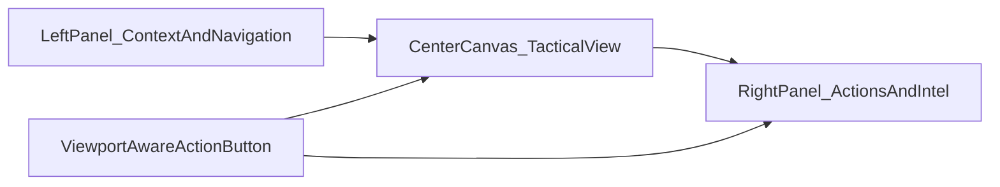

# FUSARIUM Fullscreen Operator App Execution Plan APR10 2026

Date: 2026-04-10  
Status: Active next-phase plan  
Purpose: Define the next execution phase for turning Fusarium from a route-based operator app into a hardened full-screen defense dashboard with left and right side panels, route-specific widgets, action surfaces, and viewport-aware operator controls.

## Target UX

Fusarium should become a true operator command application with:
- full-screen dashboard composition
- persistent left-side panel
- persistent right-side panel
- central tactical canvas
- action button for at-a-glance actions based on current viewport and operational context

## Layout Model

## Fullscreen Shell Specification

### Left-side panel
Purpose: context, navigation, filters, mission state, source status

Must include:
- mission summary
- dashboard switcher
- source status
- sensor network tree
- classification and trust state
- filters and time controls

Proposed components:
- `FusariumLeftRail.tsx`
- `MissionContextPanel.tsx`
- `SourceStatusPanel.tsx`
- `ViewportFiltersPanel.tsx`
- `TimeControlPanel.tsx`

### Center tactical canvas
Purpose: the main operating surface for map, threat, fusion, or command view

By route:
- `situational-awareness`: map/COP
- `threat-assessment`: threat table + evidence workspace
- `data-fusion`: pipeline/dataflow canvas
- `command-control`: operator action board and scenario tools

### Right-side panel
Purpose: actioning, drilldown, current recommendations, evidence, and selected object details

Must include:
- selected item detail
- current recommendations
- task/action buttons
- relevant evidence or provenance
- acknowledgements and operator actions

Proposed components:
- `FusariumRightRail.tsx`
- `ContextActionsPanel.tsx`
- `SelectedEntityPanel.tsx`
- `EvidenceSummaryPanel.tsx`
- `QuickCommandPanel.tsx`

### Viewport-aware action button
Purpose: expose glance actions without forcing panel expansion

Behavior:
- On wide desktop: dock near lower right of center canvas
- On narrower viewport: collapse to a floating action button
- Actions depend on current route and current selection

Examples:
- Situational Awareness:
  - focus selected contact
  - acknowledge alert
  - interrogate sensor
  - open evidence
- Threat Assessment:
  - classify
  - escalate
  - compare signatures
  - publish intel product
- Data Fusion:
  - inspect source lag
  - trace provenance
  - open model metrics
- Command & Control:
  - accept recommendation
  - modify recommendation
  - deploy sensor
  - open voice command

Proposed components:
- `FusariumActionButton.tsx`
- `FusariumActionPalette.tsx`
- `useViewportActions.ts`

## Route-Specific Widget Inventory

### Situational Awareness
Must become:
- center: `MaritimeMap`
- left: `MissionContextPanel`, `SensorNetworkPanel`, `ViewportFiltersPanel`
- right: `AlertFeed`, `SelectedEntityPanel`, `QuickCommandPanel`
- floating: `FusariumActionButton`

Widgets:
- contact summary
- sensor coverage
- AIS correlation
- environmental overlay controls
- historical replay strip

### Threat Assessment
Must become:
- center: `ThreatTable` + `ClassificationDetail`
- left: `ThreatFiltersPanel`, `ThreatTimeline`
- right: `EvidenceChain`, `CorrelationInspector`, `RecommendationInspector`
- floating: `FusariumActionButton`

Widgets:
- classification confidence
- magnetic anomaly plot
- spectrogram preview
- operator action history
- AVANI review summary

### Data Fusion
Must become:
- center: `PipelineView`
- left: `SourceHealth`, `DataQualityMetrics`
- right: `ModelPerformance`, `ProvenanceExplorer`
- floating: `FusariumActionButton`

Widgets:
- ingest lag
- source freshness
- model drift
- failed source queue
- correlation event summary

### Command & Control
Must become:
- center: `DecisionSupport` and `WhatIfSimulator`
- left: `MissionControlPanel`, `AgentManager`
- right: `SensorCommands`, `CompliancePanel`, `VoiceInterface`
- floating: `FusariumActionButton`

Widgets:
- recommendation queue
- accepted/rejected decision log
- agent health
- command execution history
- compliance event summary

## Data Sources To Bind To Widgets

### MAS
- Fusarium maritime routes
- Fusarium platform routes
- TAC-O agent cluster status
- voice command route
- AVANI ecological review
- CREP stream and commands

### MINDEX
- taco observations
- taco assessments
- ocean environments
- acoustic signatures
- magnetic baselines
- fusarium entity tracks
- fusarium correlation events
- unified search

### NatureOS
- dashboard stream
- event stream
- SignalR hub metadata

### Edge
- Zeetachec/MycoBrain status
- Mycorrhizae MDP/MMP translated device channels

## API And Route Surfaces Needed By The UI

### Already present and should be used
- `app/api/fusarium/maritime/threats/route.ts`
- `app/api/fusarium/maritime/sensors/route.ts`
- `app/api/fusarium/maritime/assessment/route.ts`
- `app/api/fusarium/maritime/route.ts`
- `app/api/fusarium/platform/mission/route.ts`
- `app/api/fusarium/platform/intel-product/route.ts`
- `app/api/fusarium/stream/route.ts`

### Still needed for richer operator UX
- proxy for `fusion-status`
- proxy for `correlation-graph`
- proxy for `contacts`
- proxy for `environment`
- proxy for `threat-history`
- proxy for `provenance/{observation_id}`
- proxy for `agents/status`
- proxy for `command/sensor/{action}`
- proxy for `voice-command`

## UI Structural Changes Required

### Replace current route view pattern
Current `components/fusarium/FusariumRouteViews.tsx` is functional, but it is still a stacked dashboard composition.

It must evolve into:
- route-specific page layouts
- panel slots
- selection-driven right rail
- viewport-aware action surface
- widget registry and slot mapping

### Introduce new structural files

Suggested next implementation group:
- `components/fusarium/layout/FusariumThreePaneLayout.tsx`
- `components/fusarium/layout/FusariumLeftRail.tsx`
- `components/fusarium/layout/FusariumRightRail.tsx`
- `components/fusarium/actions/FusariumActionButton.tsx`
- `components/fusarium/actions/FusariumActionPalette.tsx`
- `components/fusarium/context/MissionContextPanel.tsx`
- `components/fusarium/context/SourceStatusPanel.tsx`
- `components/fusarium/context/ViewportFiltersPanel.tsx`
- `components/fusarium/context/SelectedEntityPanel.tsx`
- `components/fusarium/context/QuickCommandPanel.tsx`
- `hooks/fusarium/useViewportActions.ts`
- `lib/fusarium/widget-registry.ts`

## Execution Order

1. Build `FusariumThreePaneLayout`
2. Move each route onto the three-pane shell
3. Add left rail context widgets
4. Add right rail drilldown/action widgets
5. Add viewport-aware action button
6. Add route-specific widget registry
7. Add missing proxy/API routes needed by the widgets
8. Bind source-freshness, provenance, AVANI, and degraded-state indicators into every panel
9. Validate on desktop and tablet breakpoints

## Definition Of Done

This phase is complete when:
- `/fusarium` is a real full-screen command application
- every main route uses a left rail, center canvas, and right rail
- the action button changes based on route and selection
- all major widgets use real APIs and no mock data
- the app remains usable on narrower viewports without losing operator-critical actions
- the visual structure supports later Figma/Sketch/AI Studio restyling without changing runtime logic
