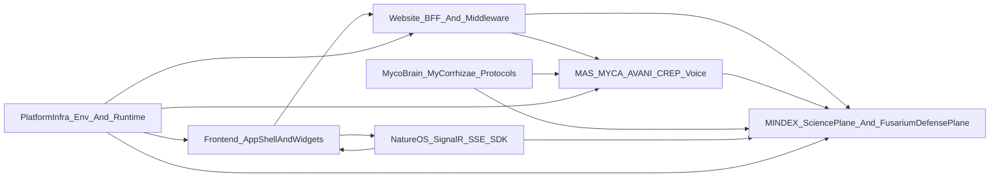

# FUSARIUM Full Frontend Middleware Backend Architecture APR10 2026

Date: 2026-04-10  
Status: Current architecture  
Purpose: Full architecture reference for Fusarium across frontend, middleware/BFF, backend, data, edge, and cross-platform integrations.

## System role

FUSARIUM is the defense customer application and integration surface built on top of the Mycosoft ecosystem.

It is:
- the defense version of the NatureOS experience
- the defense-side wrapper for additive MINDEX defense compartments
- the operator UI for maritime, environmental, sensor, training, provenance, and decision-support workflows
- the place where defense users access tools, data, widgets, models, and operator actions through one app shell

## Architecture layers

## Frontend architecture

### Route family
The operator app lives under:
- `WEBSITE/website/app/fusarium/layout.tsx`
- `WEBSITE/website/app/fusarium/page.tsx`
- `WEBSITE/website/app/fusarium/situational-awareness/page.tsx`
- `WEBSITE/website/app/fusarium/threat-assessment/page.tsx`
- `WEBSITE/website/app/fusarium/data-fusion/page.tsx`
- `WEBSITE/website/app/fusarium/command-control/page.tsx`
- `WEBSITE/website/app/fusarium/design-system/page.tsx`

### Shell
The shared shell is built from:
- `components/fusarium/shell/CUIBanner.tsx`
- `components/fusarium/shell/FusariumHeader.tsx`
- `components/fusarium/shell/FusariumNav.tsx`
- `components/fusarium/shell/OperatorStatusBar.tsx`
- `components/fusarium/shell/FusariumShell.tsx`

### Fullscreen operator layout
The fullscreen operator structure uses:
- `components/fusarium/layout/FusariumThreePaneLayout.tsx`
- `components/fusarium/layout/FusariumLeftRail.tsx`
- `components/fusarium/layout/FusariumRightRail.tsx`
- `components/fusarium/actions/FusariumActionButton.tsx`
- `components/fusarium/actions/FusariumActionPalette.tsx`
- `hooks/fusarium/useViewportActions.ts`

This gives Fusarium:
- left rail: mission, sensors, filters, trust state
- center canvas: tactical or analytical primary view
- right rail: threats, intel, drilldown, actions
- floating action surface: viewport-aware operator actions

### Route composition
Primary route composition currently lives in:
- `components/fusarium/FusariumRouteViews.tsx`

Training/data-fusion-specific catalog and readiness surfaces live in:
- `components/fusarium/FusariumTrainingDataViews.tsx`
- `app/fusarium/data-fusion/training-data/page.tsx`
- `app/fusarium/data-fusion/model-readiness/page.tsx`
- `app/fusarium/data-fusion/source-registry/page.tsx`

### Widget model
Widget registration lives in:
- `lib/fusarium/widget-registry.ts`

Workspace presets live in:
- `lib/fusarium/workspace-registry.ts`
- `hooks/fusarium/useFusariumWorkspace.ts`

### Theme and design-system layer
Theme contract:
- `components/fusarium/theme/FusariumThemeProvider.tsx`
- `components/fusarium/theme/fusarium-theme.css`
- `components/fusarium/theme/theme-contract.ts`
- `components/fusarium/theme/theme-presets.ts`

Design-system handoff:
- `lib/design-system/tokens.ts`
- `lib/design-system/component-specs.ts`
- `lib/design-system/layout-specs.ts`
- `lib/design-system/figma-mapping.ts`
- `app/fusarium/design-system/page.tsx`

These exist so Fusarium can be restyled later from Figma, Sketch, or AI Studio without changing application logic.

## Middleware and BFF architecture

### Route gating
Website route access is defined in:
- `WEBSITE/website/lib/access/routes.ts`
- `WEBSITE/website/middleware.ts`

Current behavior:
- `/fusarium` is company-gated at the route-config layer
- localhost bypass exists for Fusarium routes so local operator development does not depend on Supabase login
- company route prefixes are now properly included in middleware enforcement instead of only in route tables

### Fusarium BFF
Website proxy routes live under:
- `app/api/fusarium/route.ts`
- `app/api/fusarium/maritime/*`
- `app/api/fusarium/platform/*`
- `app/api/fusarium/catalog/*`
- `app/api/fusarium/stream/route.ts`

These BFF routes provide:
- stable browser-facing URLs
- MAS/MINDEX indirection
- environment-driven backend resolution
- explicit no-mock degraded failure behavior

## Backend architecture

### MAS responsibilities
MAS owns:
- operator and mission APIs
- MYCA/TAC-O orchestration
- AVANI review
- CREP bridge
- voice routing
- tactical decision support

Key files:
- `mycosoft_mas/core/routers/fusarium_api.py`
- `mycosoft_mas/core/routers/fusarium_platform_api.py`
- `mycosoft_mas/core/routers/crep_stream.py`
- `mycosoft_mas/core/routers/crep_command_api.py`
- `mycosoft_mas/core/routers/voice_command_api.py`
- `mycosoft_mas/core/routers/avani_router.py`

### TAC-O cluster
Agent cluster:
- `mycosoft_mas/agents/clusters/taco/signal_classifier_agent.py`
- `mycosoft_mas/agents/clusters/taco/anomaly_investigator_agent.py`
- `mycosoft_mas/agents/clusters/taco/ocean_predictor_agent.py`
- `mycosoft_mas/agents/clusters/taco/policy_compliance_agent.py`
- `mycosoft_mas/agents/clusters/taco/data_curator_agent.py`

### Integration client
Contractor-neutral maritime sensor integration:
- `mycosoft_mas/integrations/zeetachec_client.py`

This file now exposes a generic `MaritimeSensorNetworkClient` while preserving backward-compatible aliases for older import sites.

## Data architecture

### MINDEX science plane
Existing science/public/customer structures remain intact:
- `core`
- `bio`
- `obs`
- `telemetry`
- `ip`
- `ledger`
- `app.*` views

Documented in:
- `MINDEX/docs/AI_MODELS.md`

### Additive defense plane
Defense-side additive schemas:
- `fusarium_catalog`
- `fusarium_training`
- `fusarium_env`
- `fusarium_access`
- existing `fusarium` analytics schema for tracks/correlations

Key migration:
- `migrations/0032_fusarium_catalog_training_env.sql`

### Defense-side APIs
Key defense-side MINDEX routes:
- `mindex_api/routers/fusarium_catalog.py`
- `mindex_api/routers/fusarium_analytics.py`
- `mindex_api/routers/maritime.py`
- `mindex_api/routers/taco.py`
- `mindex_api/routers/worldview/maritime.py`
- `mindex_api/routers/unified_search.py`
- `mindex_api/routers/etl.py`
- `mindex_api/routers/nlm_router.py`

### One-way promotion model
Data flow rule:
- science/public/base data can promote into defense
- defense-enriched and defense-restricted data do not flow back into public/science surfaces

### Modality silos
Defense-side silos currently modeled in the additive registry include:
- underwater_pam
- vessel_uatr
- marine_bio
- aerial_bio_uav
- threat_munitions
- env_transfer_audio
- oceanographic_grid
- bathymetry
- magnetic
- ais_maritime
- sonar_imagery
- gas_chemistry
- electromagnetics
- vibration_touch
- bioelectric_fci
- model_registry

### Environment and domain cube
The additive environment cube supports:
- domains: land, sea, air, space, cyber
- vertical layers: above_canopy, below_canopy, above_ground, below_ground, subsurface_water, seafloor, cave
- environments: jungle, forest, desert, mountain, river, dry_river, wet_river, coast, littoral, reef, estuary, urban, agricultural, polar, volcanic
- time semantics: season, local_time_band, tide_state, event_window, mission_phase

## Training and model-bridge architecture

### Source registry
Source parsing and import:
- `mindex_api/utils/fusarium_training_doc_parser.py`
- `mindex_etl/jobs/bootstrap_fusarium_training_registry.py`

### P0 manifest bootstrap
- `mindex_etl/jobs/bootstrap_fusarium_p0_manifests.py`

### NLM bridge model
MINDEX is the canonical provider of:
- training manifests
- source registry rows
- environment/domain labeling
- model registry entries
- training-run metadata
- readiness summaries

NLM consumes those structures for training/evaluation and should write run/model summaries back to MINDEX.

### NLM references
- `MAS/NLM/README.md`
- `MAS/mycosoft-mas/docs/NLM_FOUNDATION_FEB10_2026.md`
- `MAS/mycosoft-mas/docs/NLM_DATABASE_SCHEMA.md`
- `MAS/mycosoft-mas/docs/NLM_MDP_MMP_ROUTE_SERVICE_COVERAGE_MAR31_2026.md`

## Edge and protocol architecture

### MycoBrain
Relevant files:
- `mycobrain/firmware/MycoBrain_FCI/include/mdp_v2_fusarium.h`
- `mycobrain/firmware/MycoBrain_FCI/include/fci_defense_profile.h`
- `mycobrain/firmware/MycoBrain_FCI/include/fci_config.h`
- `mycobrain/firmware/MycoBrain_FCI/src/fci_signal.cpp`
- `mycobrain/firmware/MycoBrain_ScienceComms/include/modem_audio.h`

### Mycorrhizae
Relevant files:
- `Mycorrhizae/mycorrhizae-protocol/mycorrhizae/protocols/mdp_types.py`
- `Mycorrhizae/mycorrhizae-protocol/mycorrhizae/gateway/device_gateway.py`

The gateway now recognizes Fusarium maritime message types and preserves contractor-neutral channel semantics on the protocol translation side.

## NatureOS and SDK architecture

### NatureOS
Relevant files:
- `NATUREOS/NatureOS/src/core-api/Controllers/MycosoftController.cs`
- `NATUREOS/NatureOS/src/core-api/Services/MycoBrainService.cs`
- `NATUREOS/NatureOS/src/ingestion/MycoBrainIngestionFunction.cs`
- `NATUREOS/NatureOS/src/mycorrhizae/MDPv1Protocol.cs`

NatureOS now has:
- a Fusarium dashboard bridge
- stream endpoint metadata
- extended MDP message recognition for tactical/maritime messages

### SDK
Relevant file:
- `MAS/sdk/natureos_sdk/client.py`

The SDK now:
- defaults to the correct NatureOS base port
- uses the Fusarium dashboard endpoint
- resolves stream endpoints from the server endpoint instead of hardcoding them

## Infra contract

Environment contract updates:
- `platform-infra/env.example`

This now includes:
- `NEXT_PUBLIC_FUSARIUM_API_BASE_URL`
- `NEXT_PUBLIC_FUSARIUM_WS_URL`

## Remaining known limitations

- NatureOS `.NET` build verification could not be completed locally because `dotnet` was not available in the current shell environment.
- Some very large source ingests in `NLM_TRAINING_DATA_SOURCES.md` are represented architecturally and through bootstrap/catalog/manifests, but not physically bulk-downloaded in-session.
- The current operator UI is structurally strong, but still has room for deeper route-specific drilldown widgets and more advanced mission-readiness analytics.

## Current source-of-truth docs

- `docs/FUSARIUM_FULL_ARCHITECTURE_IMPLEMENTATION_COMPLETE_APR09_2026.md`
- `docs/FUSARIUM_OPERATOR_APPLICATION_AND_CROSS_SYSTEM_INTEGRATION_COMPLETE_APR09_2026.md`
- `docs/FUSARIUM_PLANS_USED_SYSTEMS_GAPS_AND_INTEGRATIONS_APR10_2026.md`
- `docs/FUSARIUM_FULLSCREEN_OPERATOR_APP_EXECUTION_PLAN_APR10_2026.md`
- `docs/FUSARIUM_ADDITIVE_MINDEX_DEFENSE_PLANE_COMPLETE_APR10_2026.md`
