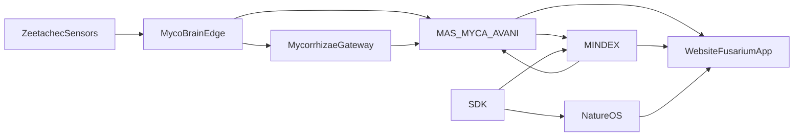

# FUSARIUM Plans Used, Systems, Gaps, And Integrations APR10 2026

Date: 2026-04-10  
Status: Current reference  
Purpose: Single reference for the planning lineage, system integrations, current implementation state, and remaining gaps for making FUSARIUM a fully functional operator application.

## Plans And Inputs Used

### Primary inputs
- `docs/zeetachec_mycosoft_taco_plan.md`
- `docs/TACO_CURSOR_IMPLEMENTATION_PLAN.md`
- Prompt 2: `FUSARIUM SYSTEM INTEGRATION WITH ZEETACHEC`
- Prompt 3: `FUSARIUM DASHBOARD CREATION/MODIFICATION FOR ZEETACHEC`

### Current implementation and planning artifacts
- `docs/FUSARIUM_FULL_ARCHITECTURE_IMPLEMENTATION_COMPLETE_APR09_2026.md`
- `docs/FUSARIUM_OPERATOR_APPLICATION_AND_CROSS_SYSTEM_INTEGRATION_COMPLETE_APR09_2026.md`
- `.cursor/plans/fusarium_ui_architecture_a17746dc.plan.md`

## Repositories And Systems In Scope

### WEBSITE
- Operator UI and app shell
- Route gating and middleware
- BFF/proxy routes to MAS and MINDEX
- CREP, search, AI Studio, NatureOS frontend patterns

### MAS
- FUSARIUM platform and maritime APIs
- MYCA orchestration
- TAC-O agent cluster
- AVANI ecological review
- CREP command and stream integration
- Voice command routing

### MINDEX
- Maritime persistence
- TAC-O observations and assessments
- Fusarium analytics
- Unified search
- RAG/retrieval
- Worldview maritime read surfaces

### MycoBrain
- Edge firmware
- maritime sensor processing
- FCI defense profile
- Fusarium-aligned message types

### Mycorrhizae
- MDP/MMP transport and gateway translation
- Redis-published protocol messages
- upstream device protocol interpretation

### NatureOS
- SignalR and SSE realtime surfaces
- Mycosoft integration controllers
- cross-platform dashboard bridge

### SDK
- NatureOS client assumptions
- cross-platform programmatic access to devices, telemetry, and Fusarium-related streams

### platform-infra
- env contract
- runtime URL assumptions
- gateway/deployment boundaries

## Current Integration Map

## Current Routes, APIs, And Surfaces

### Website operator app
- `app/fusarium/page.tsx`
- `app/fusarium/situational-awareness/page.tsx`
- `app/fusarium/threat-assessment/page.tsx`
- `app/fusarium/data-fusion/page.tsx`
- `app/fusarium/command-control/page.tsx`
- `app/fusarium/design-system/page.tsx`

### Website proxy/API routes
- `app/api/fusarium/route.ts`
- `app/api/fusarium/maritime/route.ts`
- `app/api/fusarium/maritime/threats/route.ts`
- `app/api/fusarium/maritime/sensors/route.ts`
- `app/api/fusarium/maritime/assessment/route.ts`
- `app/api/fusarium/platform/mission/route.ts`
- `app/api/fusarium/platform/intel-product/route.ts`
- `app/api/fusarium/stream/route.ts`

### MAS routes
- `mycosoft_mas/core/routers/fusarium_api.py`
- `mycosoft_mas/core/routers/fusarium_platform_api.py`
- `mycosoft_mas/core/routers/crep_stream.py`
- `mycosoft_mas/core/routers/crep_command_api.py`
- `mycosoft_mas/core/routers/voice_command_api.py`
- `mycosoft_mas/core/routers/avani_router.py`

### MINDEX routes
- `mindex_api/routers/maritime.py`
- `mindex_api/routers/taco.py`
- `mindex_api/routers/fusarium_analytics.py`
- `mindex_api/routers/worldview/maritime.py`
- `mindex_api/routers/unified_search.py`
- `mindex_api/routers/etl.py`
- `mindex_api/routers/nlm_router.py`

## Current UI Components In Fusarium

### Shell and layout
- `components/fusarium/shell/CUIBanner.tsx`
- `components/fusarium/shell/FusariumHeader.tsx`
- `components/fusarium/shell/FusariumNav.tsx`
- `components/fusarium/shell/FusariumShell.tsx`
- `components/fusarium/shell/OperatorStatusBar.tsx`
- `components/fusarium/theme/FusariumThemeProvider.tsx`

### Panels and views
- `components/fusarium/FusariumRouteViews.tsx`
- `components/fusarium/TacticalMap.tsx`
- `components/fusarium/ThreatBoard.tsx`
- `components/fusarium/SensorStatusPanel.tsx`
- `components/fusarium/DecisionAidPanel.tsx`
- `components/fusarium/IntelFeed.tsx`
- `components/fusarium/TimelinePanel.tsx`
- `components/fusarium/EntityTracksPanel.tsx`
- `components/fusarium/CorrelationPanel.tsx`
- `components/fusarium/MissionControlPanel.tsx`
- `components/fusarium/ProductComposer.tsx`
- `components/fusarium/ComplianceStatusPanel.tsx`

## Data Sources Currently In Play

### Direct tactical / maritime
- Zeetachec sensor observations
- TAC-O assessments
- ocean environment observations
- acoustic signature catalog
- magnetic baselines
- Fusarium entity tracks
- Fusarium correlation events

### Platform / cross-domain
- CREP entities
- AIS vessel context
- search/unified search domains
- AVANI ecological review
- NatureOS event and dashboard streams

## Remaining Gaps

### UI / UX gaps
- The current app is route-based and functional, but not yet a polished full-screen operator dashboard.
- The current `TacticalMap` is still a structured panel/table-style canvas, not yet a true immersive geospatial COP.
- The route views are useful and real-data-backed, but still look like assembled dashboard panels instead of a hardened command console.
- Widget density and operator workflow depth need another pass:
  - alert queueing
  - drawer-based drilldown
  - panel resizing
  - compact operator controls
  - true at-a-glance actioning

### Integration gaps
- NatureOS changes were made, but runtime verification is still pending because `dotnet` was unavailable locally.
- Edge runtime behavior is aligned structurally, but real device-level end-to-end validation is still needed with live Zeetachec/MycoBrain traffic.
- Some TAC-O agent logic is now real, but still lightweight and needs richer operational reasoning and stronger evidence packaging.
- The current operator app uses real routes and hooks, but not every backend route has a specialized purpose-built widget yet.

### Functional app gaps
- Need a true fullscreen command layout with:
  - center tactical canvas
  - persistent left operator/context rail
  - persistent right action/intelligence rail
  - responsive action button for quick-glance or viewport-sensitive actions
- Need route-specific widget inventories and a durable widget registry for Fusarium, similar in discipline to Fluid Search.
- Need explicit source-freshness and degraded-state presentation in every major widget.

## What The Next Phase Must Deliver

The next phase is not basic integration. It is application hardening and operator experience completion.

That means:
- full-screen dashboard layout
- left and right side panels
- action button for glance actions based on viewport activities
- purpose-built widgets per route
- route-aware tool surfaces
- richer data-source-to-widget mapping
- stronger visual density and mission workflow ergonomics

## Recommended Next Doc

Use the next execution doc as the working source of truth:
- `docs/FUSARIUM_FULLSCREEN_OPERATOR_APP_EXECUTION_PLAN_APR10_2026.md`
