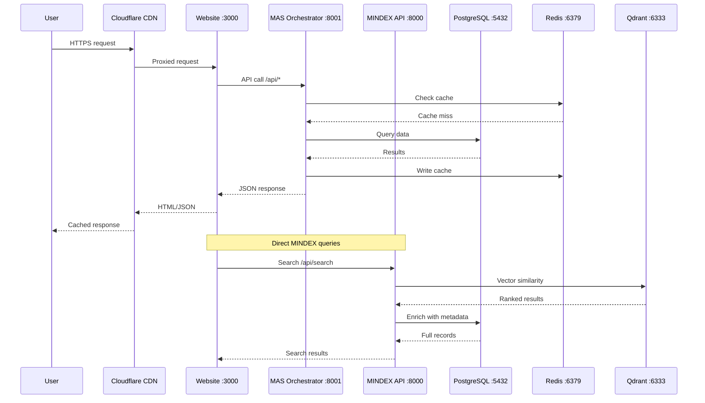
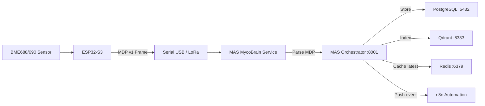
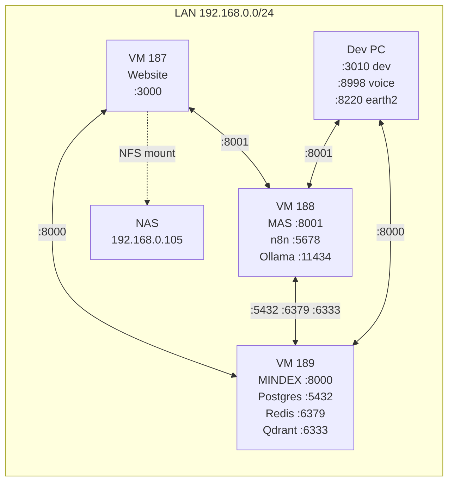
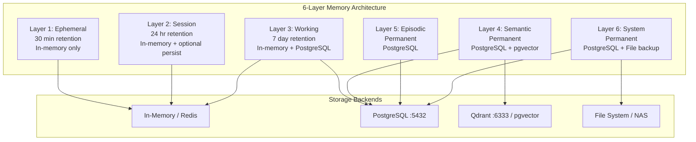
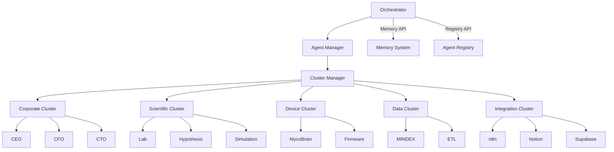
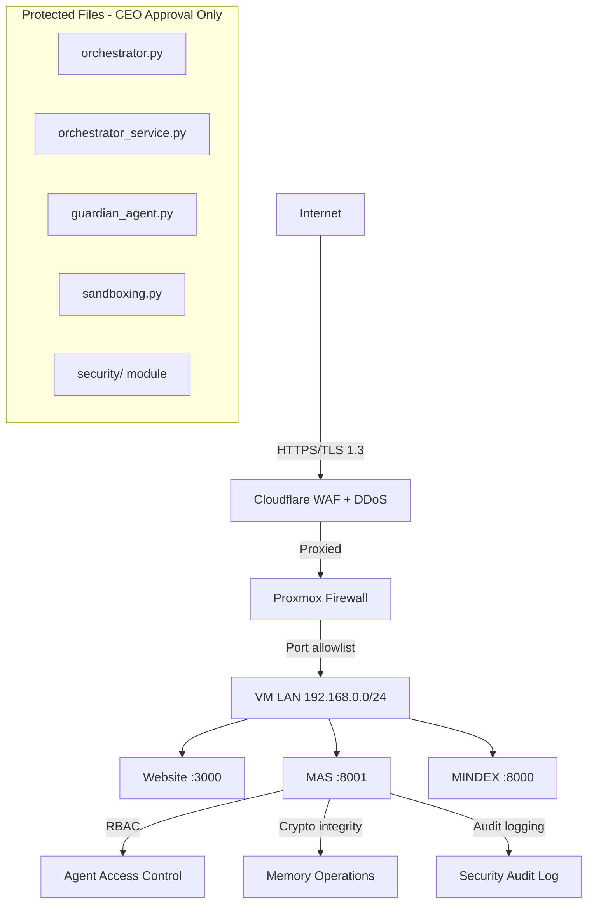
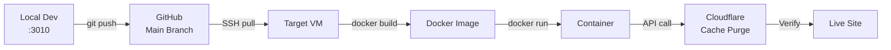

# Master Architecture Document

**Date**: February 9, 2026
**Author**: MYCA / Documentation Manager
**Status**: Complete

## Overview

The Mycosoft ecosystem is a distributed multi-agent platform spanning 9 repositories, 3 production VMs, 100+ AI agents, 200+ API endpoints, and a suite of IoT devices. This document is the single source of truth for the full system architecture, network topology, data flows, memory layers, security boundaries, and deployment pipeline.

---

## 1. Full Ecosystem Diagram

```mermaid
graph TB
    subgraph cloudflare["Cloudflare CDN"]
        cfProxy["Cloudflare Proxy & Cache"]
    end

    subgraph devMachine["Dev Machine - Local"]
        devServer["Next.js Dev Server :3010"]
        personaPlex["PersonaPlex Moshi :8998"]
        personaPlexBridge["PersonaPlex Bridge :8999"]
        earth2GPU["Earth2 GPU API :8220"]
        gpuGateway["GPU Gateway :8300"]
        cursorIDE["Cursor IDE"]
    end

    subgraph vm187["VM 187 - Sandbox (192.168.0.187)"]
        websiteContainer["Website Container :3000"]
        nextjs15["Next.js 15 App Router"]
        nasMount["NAS Volume Mount /assets"]
    end

    subgraph vm188["VM 188 - MAS (192.168.0.188)"]
        masOrchestrator["MAS Orchestrator :8001"]
        fastAPI["FastAPI + 100+ Agents"]
        n8nEngine["n8n Workflows :5678"]
        ollamaLLM["Ollama LLM :11434"]
        prometheus["Prometheus :9090"]
        whisperSTT["Whisper STT :8765"]
    end

    subgraph vm189["VM 189 - MINDEX (192.168.0.189)"]
        mindexAPI["MINDEX API :8000"]
        postgres["PostgreSQL :5432"]
        redis["Redis :6379"]
        qdrant["Qdrant Vector DB :6333"]
    end

    subgraph mycoBrainDevices["MycoBrain IoT Devices"]
        esp32["ESP32-S3 Boards"]
        bme688["BME688/690 Sensors"]
        loraGW["LoRa Gateway"]
        mdpProtocol["MDP v1 Protocol"]
    end

    subgraph natureOS["NatureOS Platform"]
        dotnet8["NET 8 Core API"]
        signalRHub["SignalR Hub"]
        azureFunctions["Azure Functions"]
    end

    subgraph platformInfra["Platform Infra"]
        dockerCompose["Docker Compose"]
        caddyfile["Caddyfile"]
        envTemplates["Env Templates"]
    end

    %% Internet to Cloudflare to Website
    cfProxy -->|"HTTPS"| websiteContainer

    %% Website container internals
    websiteContainer --- nextjs15
    websiteContainer --- nasMount

    %% Website to backend APIs
    websiteContainer -->|"REST /api/*"| masOrchestrator
    websiteContainer -->|"REST /api/*"| mindexAPI

    %% Dev machine flows
    devServer -->|"REST"| masOrchestrator
    devServer -->|"REST"| mindexAPI
    personaPlex -->|"Voice stream"| masOrchestrator
    earth2GPU -->|"Viz data"| devServer
    cursorIDE -->|"Code edits"| devServer

    %% MAS internal
    masOrchestrator --- fastAPI
    masOrchestrator -->|"SQL + pgvector"| postgres
    masOrchestrator -->|"Cache"| redis
    masOrchestrator -->|"Embeddings"| qdrant
    masOrchestrator -->|"LLM inference"| ollamaLLM

    %% n8n flows
    n8nEngine -->|"Webhook triggers"| masOrchestrator
    masOrchestrator -->|"Workflow exec"| n8nEngine

    %% MINDEX internals
    mindexAPI --- postgres
    mindexAPI --- redis
    mindexAPI --- qdrant

    %% MycoBrain to MAS
    esp32 -->|"Serial/MDP v1"| masOrchestrator
    esp32 --- bme688
    esp32 --- loraGW
    esp32 --- mdpProtocol

    %% NatureOS connections
    dotnet8 -->|"REST"| masOrchestrator
    dotnet8 --- signalRHub
    dotnet8 --- azureFunctions

    %% Platform Infra supports all VMs
    platformInfra -.->|"Config"| vm187
    platformInfra -.->|"Config"| vm188
    platformInfra -.->|"Config"| vm189

    %% Prometheus monitoring
    prometheus -.->|"Scrape"| masOrchestrator
    prometheus -.->|"Scrape"| mindexAPI

    %% Styling
    classDef vmBox fill:#1a1a2e,stroke:#16213e,color:#e0e0e0
    classDef service fill:#0f3460,stroke:#533483,color:#e0e0e0
    classDef db fill:#1e5128,stroke:#4e9f3d,color:#e0e0e0
    classDef device fill:#5c2a00,stroke:#c07000,color:#e0e0e0
    classDef infra fill:#2d2d2d,stroke:#666,color:#ccc

    class websiteContainer,masOrchestrator,mindexAPI,n8nEngine service
    class postgres,redis,qdrant db
    class esp32,bme688,loraGW device
```



---

## 2. Data Flow Architecture

### 2.1 Request Flows



### 2.2 Data Flow Summary Table

| Source | Destination | Protocol | Path | Purpose |
|--------|-------------|----------|------|---------|
| Website (187) | MAS (188) | REST/HTTP | `/api/*` on :8001 | Agent orchestration, memory, voice, registry |
| Website (187) | MINDEX (189) | REST/HTTP | `/api/*` on :8000 | Search, taxonomy, species data, knowledge graph |
| MAS (188) | MINDEX (189) | TCP | PostgreSQL :5432, Redis :6379, Qdrant :6333 | Database queries, cache, vector embeddings |
| MycoBrain | MAS (188) | Serial/MDP v1 | USB serial or LoRa gateway | Telemetry ingestion (temp, humidity, VOC, gas) |
| n8n (188) | MAS (188) | REST/HTTP | Webhook on :8001 | Workflow triggers, scheduled automations |
| Earth2 GPU (local) | Website (3010) | REST/HTTP | `:8220` to dev server | Weather/climate visualization data |
| PersonaPlex (local) | MAS (188) | WebSocket/REST | `:8998`/`:8999` to :8001 | Voice intent -> orchestrator routing |
| MAS (188) | Ollama (188) | REST/HTTP | `:11434` | LLM inference (Llama, Mistral, embeddings) |
| MAS (188) | n8n (188) | REST/HTTP | `:5678` | Workflow execution, status polling |
| NatureOS | MAS (188) | REST/HTTP | `:8001` | Device management, telemetry relay |
| Cloudflare | Website (187) | HTTPS | `:443` -> `:3000` | CDN proxy, SSL termination, caching |

### 2.3 MycoBrain Telemetry Ingestion



### 2.4 Voice Pipeline


---

## 3. Network Topology

### 3.1 VM Assignment

| VM | IP Address | Hostname | Role | OS |
|----|------------|----------|------|----|
| Sandbox | 192.168.0.187 | sandbox | Website (Docker), Claude Code | Ubuntu (Proxmox) |
| MAS | 192.168.0.188 | mas | Orchestrator, agents, n8n, Ollama | Ubuntu (Proxmox) |
| MINDEX | 192.168.0.189 | mindex | Database, vector store, search API | Ubuntu (Proxmox) |

### 3.2 Port Assignment Map

| Port | VM/Host | Service | Protocol | Always On |
|------|---------|---------|----------|-----------|
| 3000 | 187 | Website Docker container | HTTP | Yes |
| 3010 | Local | Website dev server | HTTP | When developing |
| 5432 | 189 | PostgreSQL | TCP | Yes |
| 5678 | 188 | n8n workflow engine | HTTP | Yes |
| 6333 | 189 | Qdrant vector DB | HTTP/gRPC | Yes |
| 6379 | 189 | Redis cache | TCP | Yes |
| 8000 | 189 | MINDEX API (FastAPI) | HTTP | Yes |
| 8001 | 188 | MAS Orchestrator (FastAPI) | HTTP | Yes |
| 8002 | Local/187 | Mycorrhizae API | HTTP | When needed |
| 8003 | Local | MycoBrain serial service | HTTP | When testing devices |
| 8010 | Local | MyceliumSeg API | HTTP | When needed |
| 8042 | Local | Smell Trainer agent | HTTP | When training |
| 8100 | Local | Threat Intel service | HTTP | When needed |
| 8210 | Local | E2CC API Gateway | HTTP | When needed |
| 8220 | Local | Earth2 GPU API | HTTP | When needed (GPU) |
| 8300 | Local | GPU Gateway | HTTP | When needed (GPU) |
| 8765 | 188 | Whisper STT | WebSocket | When voice needed |
| 8998 | Local | PersonaPlex/Moshi | HTTP/WS | When needed (GPU) |
| 8999 | Local | PersonaPlex Bridge | HTTP | When needed (GPU) |
| 9090 | 188 | Prometheus | HTTP | Yes |
| 11434 | 188 | Ollama LLM | HTTP | Yes |

### 3.3 Inter-VM Communication



---

## 4. Repository Map

| # | Repository | Path | Language | Entry Point | VM/Host | Purpose |
|---|-----------|------|----------|-------------|---------|---------|
| 1 | **MAS** | `MAS/mycosoft-mas/` | Python 3.13, FastAPI | `mycosoft_mas/core/myca_main.py` | 188 :8001 | Multi-Agent System, 100+ agents, orchestrator, memory |
| 2 | **Website** | `WEBSITE/website/` | TypeScript, Next.js 15 | `app/layout.tsx` | 187 :3000 | Web UI, 265+ API routes, 373+ components |
| 3 | **MINDEX** | `MINDEX/mindex/` | Python 3.11, FastAPI | `mindex_api/main.py` | 189 :8000 | Database API, ETL, 12 routers, 17 ETL jobs |
| 4 | **MycoBrain** | `mycobrain/` | C++ (PlatformIO) | `firmware/*/src/main.cpp` | ESP32 devices | IoT firmware, MDP v1, 7 firmware variants |
| 5 | **NatureOS** | `NATUREOS/NatureOS/` | C# (.NET 8.0) | `src/core-api/Program.cs` | Azure/188 | Nature OS platform, SignalR, Azure Functions |
| 6 | **Mycorrhizae** | `Mycorrhizae/mycorrhizae-protocol/` | Python 3.10, FastAPI | `api/main.py` | Local :8002 | Protocol layer, FCI, Hypha Programming Language |
| 7 | **NLM** | `MAS/NLM/` | Python | `nlm/` | 188 | Nature Learning Models |
| 8 | **SDK** | `MAS/sdk/` | Python | `sdk/` | N/A (library) | NatureOS Python SDK |
| 9 | **Platform-Infra** | `platform-infra/` | YAML, Shell | `docker-compose.yml` | All VMs | Docker configs, Caddyfile, env templates |

### Repository Statistics

| Metric | Count |
|--------|-------|
| Total repositories | 9 |
| Total source files | ~5,000+ |
| Languages | Python, TypeScript, C#, C++ |
| MAS API routers | 20+ |
| MINDEX API routers | 12 |
| Website API routes | 265+ |
| Website pages | 100+ |
| Website components | 373+ |
| MAS agents | 100+ |
| ETL jobs | 17 |
| Documentation files | 1,275+ |
| Docker containers (prod) | 17+ |

---

## 5. Memory Architecture (6 Layers)

The MYCA Memory System provides persistent, multi-layered memory across the entire agent ecosystem.



### Layer Details

| Layer | Retention | Storage | Use Cases |
|-------|-----------|---------|-----------|
| **Ephemeral** | 30 minutes | In-memory only | Current calculation context, temporary variables |
| **Session** | 24 hours | In-memory + optional persistence | Dialog history, user preferences during session |
| **Working** | 7 days | In-memory + PostgreSQL backup | Multi-step task progress, pending operations |
| **Semantic** | Permanent | PostgreSQL + vector embeddings (pgvector/Qdrant) | Learned facts, system knowledge, user preferences |
| **Episodic** | Permanent | PostgreSQL | Significant interactions, decisions, errors, events |
| **System** | Permanent | PostgreSQL + file backup | Configurations, learned patterns, calibration data |

### Memory Database Schemas

| Schema | Tables | Purpose |
|--------|--------|---------|
| `memory` | entries, consolidations | Unified 6-layer memory storage |
| `mem0` | memories | Mem0-compatible API storage |
| `mcp` | memories | MCP memory server for Claude |
| `voice` | sessions, feedback | Voice session persistence |
| `workflow` | executions, patterns | Workflow history from n8n |
| `graph` | nodes, edges | Knowledge graph relationships |
| `cross_session` | user_context | Cross-session user data |

### Core Memory Modules

| Module | Location | Purpose |
|--------|----------|---------|
| `myca_memory.py` | `mycosoft_mas/memory/` | 6-layer memory management (read, write, consolidate) |
| `personaplex_memory.py` | `mycosoft_mas/memory/` | Voice session persistence |
| `n8n_memory.py` | `mycosoft_mas/memory/` | Workflow execution history |
| `mem0_adapter.py` | `mycosoft_mas/memory/` | Mem0-compatible API adapter |
| `mcp_memory_server.py` | `mycosoft_mas/memory/` | MCP server for Claude memory access |
| `vector_memory.py` | `mycosoft_mas/memory/` | Qdrant vector search |
| `graph_memory.py` | `mycosoft_mas/memory/` | Knowledge graph operations |
| `persistent_graph.py` | `mycosoft_mas/memory/` | Persistent graph storage |
| `long_term.py` | `mycosoft_mas/memory/` | Long-term memory consolidation |
| `short_term.py` | `mycosoft_mas/memory/` | Short-term buffer management |

---

## 6. Agent Architecture

### Agent Categories (14 Categories, 100+ Agents)

| Category | Count | Key Agents |
|----------|-------|------------|
| Corporate | 9 | CEOAgent, CFOAgent, CTOAgent, COOAgent, LegalAgent, HRAgent |
| Infrastructure | 8 | ProxmoxAgent, DockerAgent, NetworkAgent, DeploymentAgent, CloudflareAgent |
| Scientific | 8+ | LabAgent, HypothesisAgent, SimulationAgent, AlphaFoldAgent |
| Device | 7 | MycoBrainCoordinator, BME688Agent, BME690Agent, LoRaGateway, FirmwareAgent |
| Data | 4 | MindexAgent, ETLAgent, SearchAgent, RouteMonitorAgent |
| Integration | 11 | N8NAgent, SupabaseAgent, NotionAgent, WebsiteAgent, AnthropicAgent |
| Financial | 3+ | FinancialAgent, FinanceAdminAgent, FinancialOperationsAgent |
| Security | 2+ | SecurityAgent, GuardianAgent |
| Mycology | 2 | MycologyBioAgent, MycologyKnowledgeAgent |
| Earth2 | 5 | Earth2Orchestrator, WeatherForecast, ClimateSimulation |
| Simulation | 5+ | AlphaFoldAgent, MyceliumSimulator, PhysicsSimulator |
| Business | 6+ | SecretaryAgent, SalesAgent, MarketingAgent, ProjectManagerAgent |
| Core | 3+ | Orchestrator, AgentManager, ClusterManager |
| Custom | 2+ | OpportunityScout, WiFiSenseAgent |

### Agent Communication Pattern



---

## 7. Security Boundaries

### Service-to-Service Access Matrix

| Source | Destination | Auth Method | Allowed Paths |
|--------|-------------|-------------|---------------|
| Cloudflare | Website (187 :3000) | IP allowlist + SSL | `/*` (full site) |
| Website (187) | MAS (188 :8001) | Internal network (no public) | `/api/*`, `/health` |
| Website (187) | MINDEX (189 :8000) | Internal network (no public) | `/api/*`, `/health` |
| MAS (188) | PostgreSQL (189 :5432) | Username/password (env var) | SQL queries |
| MAS (188) | Redis (189 :6379) | Password (env var) | Cache ops |
| MAS (188) | Qdrant (189 :6333) | API key (env var) | Vector ops |
| MAS (188) | Ollama (188 :11434) | Localhost only | `/api/generate`, `/api/embeddings` |
| MAS (188) | n8n (188 :5678) | Bearer token | `/api/v1/*` |
| Dev PC | MAS (188) | LAN only, no auth | `/api/*`, `/health` |
| Dev PC | MINDEX (189) | LAN only, no auth | `/api/*`, `/health` |
| MycoBrain | MAS (188) | Serial (physical), LoRa (encrypted) | MDP v1 frames |
| NatureOS | MAS (188) | API key | `/api/*` |

### Security Layers



### Authentication Methods

| Method | Used By | Details |
|--------|---------|---------|
| Cloudflare SSL/Proxy | Public traffic | TLS 1.3, WAF rules, DDoS protection |
| Supabase Auth (JWT) | Website users | Row Level Security, OAuth providers |
| API Keys (env vars) | Service-to-service | Stored in `.env`, never in code |
| Database credentials | MAS -> PostgreSQL | Username/password via env vars |
| Bearer tokens | MAS -> n8n | Per-workflow authentication |
| Physical serial | MycoBrain -> MAS | USB connection, no network exposure |
| LoRa encryption | MycoBrain -> Gateway | AES-128 over LoRa radio |

### Critical Security Rules

- **NEVER** commit secrets or API keys to git
- **NEVER** modify protected files without CEO-level approval
- Memory writes include cryptographic integrity checks
- All API access logged to security audit table
- Base64 encoding used in legacy (flagged for AES-GCM migration)

---

## 8. Deployment Pipeline

### Pipeline Overview



### Per-System Deployment

#### Website (VM 187 - Sandbox)

```bash
# 1. Push to GitHub
git add . && git commit -m "message" && git push origin main

# 2. SSH to Sandbox VM
ssh mycosoft@192.168.0.187

# 3. Pull latest code
cd /opt/mycosoft/website && git pull origin main

# 4. Rebuild Docker image
docker build -t mycosoft-always-on-mycosoft-website:latest --no-cache .

# 5. Stop and remove old container
docker stop mycosoft-website && docker rm mycosoft-website

# 6. Run new container with NAS mount
docker run -d --name mycosoft-website -p 3000:3000 \
  -v /opt/mycosoft/media/website/assets:/app/public/assets:ro \
  --restart unless-stopped mycosoft-always-on-mycosoft-website:latest

# 7. Purge Cloudflare cache (Purge Everything)
# 8. Verify: sandbox.mycosoft.com
```

#### MAS Orchestrator (VM 188)

```bash
ssh mycosoft@192.168.0.188
cd /home/mycosoft/mycosoft/mas && git pull
docker build -t mycosoft/mas-agent:latest --no-cache .
docker stop myca-orchestrator-new && docker rm myca-orchestrator-new
docker run -d --name myca-orchestrator-new --restart unless-stopped \
  -p 8001:8000 mycosoft/mas-agent:latest
```

#### MINDEX API (VM 189)

```bash
ssh mycosoft@192.168.0.189
cd /opt/mindex && git pull
docker compose stop mindex-api
docker compose build --no-cache mindex-api
docker compose up -d mindex-api
```

### Rollback Procedures

| Method | Command | When to Use |
|--------|---------|-------------|
| Git reset | `git reset --hard HEAD~1` | Bad code deployed |
| Docker image tag | `docker run ... previous-tag` | Container crash |
| Proxmox snapshot | Proxmox UI -> Restore snapshot | VM-level failure |
| Database backup | `pg_restore -d mycosoft latest.dump` | Data corruption |

---

## 9. Key File Locations (MAS Repo)

| Purpose | Path |
|---------|------|
| Main application entry | `mycosoft_mas/core/myca_main.py` |
| Orchestrator (PROTECTED) | `mycosoft_mas/core/orchestrator.py` |
| Orchestrator service (PROTECTED) | `mycosoft_mas/core/orchestrator_service.py` |
| All API routers | `mycosoft_mas/core/routers/` |
| All v1 agents | `mycosoft_mas/agents/` |
| All v2 agents | `mycosoft_mas/agents/v2/` |
| Cluster agents | `mycosoft_mas/agents/clusters/` |
| Memory system | `mycosoft_mas/memory/` |
| Voice system | `mycosoft_mas/voice/` |
| Integrations | `mycosoft_mas/integrations/` |
| Safety (PROTECTED) | `mycosoft_mas/safety/` |
| Security (PROTECTED) | `mycosoft_mas/security/` |
| Devices | `mycosoft_mas/devices/` |
| Bio/FCI | `mycosoft_mas/bio/` |
| LLM wrappers | `mycosoft_mas/llm/` |
| Simulations | `mycosoft_mas/simulation/` |
| Tests | `tests/` |
| Migrations | `migrations/` |
| Documentation (380+ files) | `docs/` |

---

## 10. Related Documents

| Document | Path | Purpose |
|----------|------|---------|
| System Registry | `docs/SYSTEM_REGISTRY_FEB04_2026.md` | Agents, services, devices |
| API Catalog | `docs/API_CATALOG_FEB04_2026.md` | All 200+ API endpoints |
| System Map | `docs/system_map.md` | Visual system map |
| Memory Architecture | `docs/MYCA_MEMORY_ARCHITECTURE_FEB05_2026.md` | 6-layer memory details |
| Memory Docs Index | `docs/MEMORY_DOCUMENTATION_INDEX_FEB05_2026.md` | Memory system docs |
| VM Layout | `docs/VM_LAYOUT_AND_DEV_REMOTE_SERVICES_FEB06_2026.md` | VM-to-VM connectivity |
| Deploy Pipeline | `docs/DEV_TO_SANDBOX_PIPELINE_FEB06_2026.md` | Deployment procedures |
| Agent Registry | `docs/AGENT_REGISTRY_FULL_FEB09_2026.md` | Full agent list and counts |
| Security Bugfixes | `docs/SECURITY_BUGFIXES_FEB09_2026.md` | Critical security fixes |
| Master Doc Index | `docs/MASTER_DOCUMENT_INDEX.md` | Index of all documentation |
