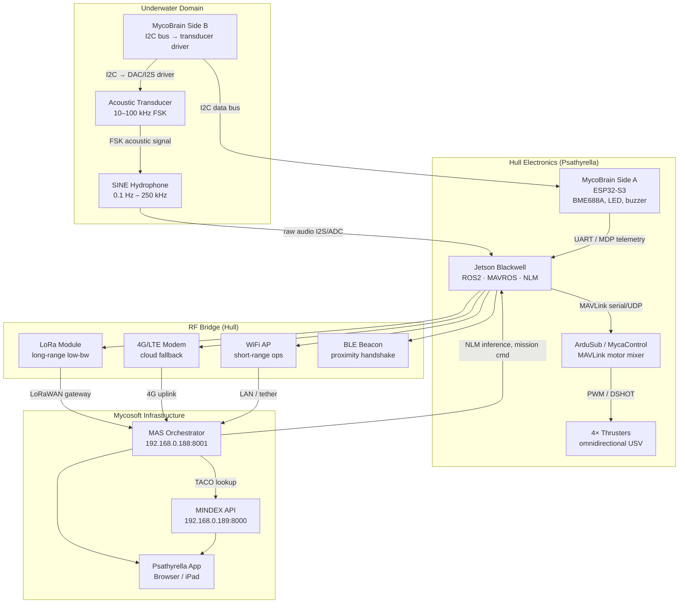

# Psathyrella Buoy — Autonomous Operations Stack Plan
**Date: June 25, 2026**  
**Status: Planning / Pre-Implementation**  
**Prime: Mycosoft LLC — 100% prime**  
**Classification: Internal Engineering Plan**

---

## Executive Summary

Psathyrella is Mycosoft's autonomous underwater surface vehicle (USV) buoy platform, anchored at Project Oyster (North Reef, 32.56289, -117.1357). The device is already live: `psathyrella-buoy-com4` is registered, firmware `side-a-mdp-2.1.1` flashed, BME688 A producing live telemetry, and the Earth Simulator widget is operational.

This plan covers six deliverables: (1) Earth Simulator validation checklist before hull install, (2) autonomy stack selection for 4-thruster marine operations, (3) Psathyrella App architecture, (4) comms architecture from underwater to cloud, (5) CAD/robotics skills plan, and (6) phased implementation from pool test to TAC-O bay demo.

**Recommended autonomy stack: MycaControl ArduSub (ArduPilot) + ROS2 MAVROS on Jetson Blackwell + MYCA MAS as mission planner. Do not use AgaricFlight for the buoy.**

---

## Section 1 — MycoBrain + Earth Simulator Test Checklist

### Pre-install validation (COM4 / psathyrella-buoy-com4)

> Goal: confirm all acceptance criteria from the May 31 handoff are met before the board enters the V1 hull for pool testing.

#### 1.1 Hardware verification (bench, pre-pool)

| # | Check | Expected result | Command |
|---|-------|-----------------|---------|
| H1 | MycoBrain service health | `{"ok":true,"devices":1}` | `GET :8003/health` |
| H2 | Device in registry | `mycobrain-COM4` with `side-a-mdp-2.1.1` | `GET :8003/devices` |
| H3 | BME688 A (0x77) present + subscribed | `present=YES begin=OK sub=OK` | `POST :8003/devices/mycobrain-COM4/cli` `{"command":"status"}` |
| H4 | BME688 B (0x76) status | `present=NO` acceptable until 0x76 hardware wired | Same as H3 |
| H5 | Live BME688 A numeric telemetry | temp, humidity, pressure, IAQ, eCO2, bVOC all non-null | `GET :3010/api/mycobrain/COM4/sensors` |
| H6 | Beep Test — single short beep, no latch | Hear one beep <500ms, service returns success | `POST :8003 command buzzer beep` |
| H7 | Buzzer Off | No buzzer sound after command | `POST command buzzer off` |
| H8 | LED Rainbow — visible on board | NeoPixel cycles colors | `POST command led pattern rainbow` |
| H9 | LED Off | LED goes dark | `POST command led off` |
| H10 | OPTX stub responds | `{"ok":true,"optx":"started"}` | `POST command optx start TEST` |
| H11 | AOTX stub responds | `{"ok":true,"aotx":"started"}` | `POST command aotx start TEST` |
| H12 | Ping | `{"type":"pong"}` or similar | `POST command ping` |
| H13 | Earth Simulator device list | psathyrella-buoy-com4 with numeric telemetry | `GET :3010/api/earth-simulator/devices` |
| H14 | Earth Simulator widget renders | PsathyrellaBuoyPanel visible, BME688 A data, marine metrics in standby | Browser at `localhost:3010` → CREP → Earth map |
| H15 | Widget buttons single-click | All 7 buoy buttons (Beep, Buzzer Off, LED Rainbow, LED Off, Record LF, Record HF, Ping) execute on single click with no freeze | Manual UI test |
| H16 | Widget sustained (60s) | No freeze after repeated open/close for 60s | Manual UI test |
| H17 | Auth boundary | Actuator commands rejected on unauthenticated prod; local dev bypass is explicit and non-deployable | Auth test |

#### 1.2 Gap tracking

| Gap | Description | Priority |
|-----|-------------|----------|
| BME688 B (0x76) | Not detected — needs hardware wiring on Side B bus or second board | P1 before dual-sensor contract |
| optx / aotx wired to transducer | Current stubs use buzzer FSK; real transducer needs I2S/DAC driver | P1 before pool acoustic test |
| agent_url mismatch | Earth Simulator points to `192.168.0.241:8003` (Voice Legion); local dev uses `localhost:8003` | P2 — confirm path in staging |

#### 1.3 Pool pre-seal checklist (before waterproofing hull)

- [ ] All H1–H17 checks pass
- [ ] BME688 A telemetry logged for 30 min continuous with no NaN/empty
- [ ] Buzzer does not latch even after 10 rapid Beep commands
- [ ] Transducer stub wired to actual transducer driver pin (even if software incomplete)
- [ ] Side B I2C bus confirmed accessible via firmware (regardless of sensor presence)
- [ ] Firmware BSEC profile confirmed stable (no reboot loops in 2h soak)
- [ ] Physical seal inspection on all cable glands and sensor ports
- [ ] Pool test with 2m tether before any free-float

---

## Section 2 — Autonomy Stack Recommendation

### 2.1 Candidate analysis

#### MycaControl (MycosoftLabs/MycaControl — ArduPilot fork, GPL-3.0)

**What it is:** Mycosoft's fork of ArduPilot (`forked from ArduPilot/ardupilot`), described as "a baseline controller for walking, swimming and flying droids." Contains full ArduPilot stack including **ArduSub** — ArduPilot's dedicated underwater/surface vehicle vehicle type.

**What ArduSub provides for Psathyrella:**
- Motor mixer for 4-, 6-, and 8-thruster vectored configurations (including omnidirectional USV surface setups)
- Flight modes directly applicable to USV: Manual, Stabilize, Depth Hold, Auto, Guided, Loiter, Circle
- MAVLink protocol for GCS, ROS2 (via MAVROS), and custom telemetry
- EKF2/EKF3 state estimator with GPS, IMU, compass, depth sensor fusion
- Terrain following via barometer or depth sensor (for surface hold)
- Python/Lua scripting for custom mission logic
- Companion computer interface (ideal for Jetson as high-level planner)
- **ArduSub `Rover/Boat` mode** specifically for surface USVs with differential steering or vectored thrust

**Hardware targets:** Pixhawk / Cube Orange (most robust), or **BlueOS on Raspberry Pi** (lightweight, excellent for companion computer pairing with Jetson). Jetson can run MAVROS/ROS2 as companion.

**Verdict: STRONGLY RECOMMENDED as vehicle control layer.** 72,515 commits, mature, battle-tested on Blue Robotics BlueBoat/ROV community. ArduSub is exactly right for a 4-thruster surface/underwater vehicle.

---

#### AgaricFlight (MycosoftLabs/AgaricFlight — EmuFlight fork)

**What it is:** EmuFlight is a Betaflight/Cleanflight fork for FPV racing multirotor drones. Motor mixing via DSHOT/Oneshot ESC protocol, PID tuning focus.

**Does it work for the buoy? NO.**
- No concept of GPS waypoint navigation, autonomous missions, or path planning
- No marine or surface vehicle frame types
- ESC protocol (DSHOT) designed for brushless FPV motors, not thruster ESCs
- No MAVLink, no ROS2 integration, no companion computer architecture
- No depth sensing, no GPS hold, no return-to-launch

**What AgaricFlight IS for:** The Agaric aerial drone complement to Psathyrella. When Psathyrella deploys an Agaric drone for aerial reconnaissance or relay, AgaricFlight handles the multirotor flight controller. Do not cross the use cases.

**Verdict: NOT for the buoy. Keep for Agaric drones only.**

---

#### Autoware (autowarefoundation/autoware — full self-driving car stack, Apache 2.0)

**What it is:** Complete autonomous driving stack for on-road vehicles. ROS2 Humble/Jazzy. Perception (LiDAR, camera), prediction, planning (lanes, intersections), control (lateral/longitudinal).

**Subsystems that DO map to USV:**
- Localization: NDT scan matching, EKF pose estimator — **useful** for GPS-denied positioning
- Perception: Camera/LiDAR object detection — **useful** for obstacle avoidance around buoy
- ROS2 bridge infrastructure — **useful** as a framework

**Subsystems that do NOT map (do not port):**
- Lane driving, lane change, parking, traffic signal handling — all irrelevant in open water
- HD map dependency (lanelet2) — no nautical chart equivalent built in
- Vehicle kinematic model assumes car dynamics — wrong for 4-thruster omnidirectional USV

**Verdict: DO NOT use full Autoware on Jetson for Psathyrella.** Too heavy, wrong assumptions, GPL-adjacent in places. Instead, use the ArduSub + MAVROS architecture which is proven on Jetson-class SBCs. If specific Autoware packages are needed (e.g. NDT localization), pull them individually as ROS2 packages — don't import the full stack.

---

### 2.2 Recommended stack

```
┌─────────────────────────────────────────────────────────────┐
│                   MYCA MAS (192.168.0.188)                  │
│  Mission planning · Fleet orchestration · MINDEX queries    │
│  Sends guided waypoints via MAVLink / MAS Psathyrella Agent │
└──────────────────────┬──────────────────────────────────────┘
                       │ HTTP/WS (MAS API 8001)
┌──────────────────────┴──────────────────────────────────────┐
│             Jetson Blackwell (on buoy)                      │
│  ROS2 Humble + MAVROS → MAVLink → ArduSub                   │
│  SINE audio stream ingest → NLM inference                   │
│  Ultralytics YOLOv11 (camera object detection)              │
│  4G/WiFi/LoRa radio management                              │
└────────────┬───────────────────────────┬────────────────────┘
             │ MAVLink (serial/UDP)       │ I2C/SPI
┌────────────┴──────────────┐  ┌─────────┴────────────────────┐
│  MycaControl ArduSub      │  │  MycoBrain (ESP32-S3)         │
│  (Pixhawk or BlueOS Pi)   │  │  Side A: BME688, GPS, LED    │
│  4-thruster motor mixing  │  │  Side B: transducer I2C bus  │
│  EKF2 state estimation    │  │  OPTX/AOTX modems            │
│  GPS hold / depth hold    │  │  Sensor telemetry → MAS      │
└───────────────────────────┘  └──────────────────────────────┘
```

**Object detection recommendation:** Ultralytics YOLOv11 (FOSS, Apache 2.0, ONNX/TensorRT on Jetson). This likely matches what you starred on GitHub. Run real-time on Jetson GPU, publish detections to ROS2 topic → MAVROS → buoy avoidance behavior.

---

## Section 3 — Psathyrella App Architecture

### 3.1 App location

`/app/natureos/psathyrella/` within the website repo. iPad-first, mobile-first responsive layout.

### 3.2 Pages and routes

| Route | Page | Description |
|-------|------|-------------|
| `/natureos/psathyrella` | Dashboard | Live map, telemetry summary, mission status, quick controls |
| `/natureos/psathyrella/control` | Mission Control | Joystick UI, waypoint planner, ArduSub mode selector, thruster health |
| `/natureos/psathyrella/acoustics` | Acoustic Monitor | SINE hydrophone live stream visualization, NLM species classification feed |
| `/natureos/psathyrella/comms` | Comms Status | Link quality (LoRa/4G/WiFi/BLE/acoustic), RSSI, latency matrix |
| `/natureos/psathyrella/fleet` | Fleet | Multi-buoy overview (for future fleet at Project Oyster + beyond) |
| `/natureos/psathyrella/logs` | Mission Logs | Dive history, waypoint playback, acoustic clip archive |

### 3.3 Integration points

| System | Endpoint | Data |
|--------|----------|------|
| MAS Orchestrator | `ws://192.168.0.188:8001/ws/psathyrella` | Telemetry push, mission events, NLM results |
| MycoBrain Service | `http://192.168.0.241:8003` | BME688 readings, LED/buzzer control, transducer commands |
| Jetson (ArduSub) | `ws://JETSON_IP:PORT/mavlink` | MAVLink heartbeat, attitude, position, thruster output |
| Jetson (SINE) | `ws://JETSON_IP:PORT/audio` | Raw hydrophone stream, SINE classifier output |
| MINDEX `/taco` | `http://192.168.0.189:8000/api/taco/classify` | Acoustic species classification lookup |
| Earth Simulator | `/api/earth-simulator/devices` | Device registry + map pin |

### 3.4 WebSocket and API flows

```
Browser (iPad)
  │
  ├── ws: /api/psathyrella/ws
  │     Next.js API route proxies:
  │     ├── MAS WS (mission events, telemetry)
  │     └── Jetson WS (MAVLink data)
  │
  ├── GET /api/psathyrella/telemetry          → MAS → MycoBrain :8003
  ├── POST /api/psathyrella/command           → MAS → MycoBrain / Jetson
  ├── GET /api/psathyrella/acoustics/stream   → Jetson audio WS
  ├── GET /api/psathyrella/acoustics/classify → MINDEX /taco
  └── GET /api/psathyrella/mission            → MAS mission state
```

### 3.5 iPad / mobile-first requirements

- All touch targets ≥ 44×44px
- Joystick control uses canvas-based virtual stick (no native gamepad required)
- Map uses existing Earth Simulator component with Psathyrella pin selected
- Bottom sheet navigation for mobile (no sidebar on portrait)
- Acoustic spectrogram uses WebAudio API or server-rendered PNG streaming
- Offline status detection: show "link lost" banner with last known telemetry age
- Dark theme only (ocean operational context)

---

## Section 4 — Comms Architecture (Mermaid)



**Clarification on SINE bandwidth:** The SINE hydrophone spec is broadband **~0.1 Hz – 250 kHz**. The user stated "1kHz–250MHz" — this is almost certainly a typo for **250 kHz** (hydrophones do not operate at 250 MHz; that is microwave RF). The NLM acoustic classifier should be designed for the 0.1 Hz – 250 kHz range, sampled at ≥500 kSps for full Nyquist coverage (in practice, 96 kSps or 192 kSps is standard for broadband underwater acoustics).

**Underwater comms note:** The current AOTX implementation in Side A firmware (buzzer FSK at 1 kHz/2 kHz) is air-acoustic and NOT suitable for underwater transmission. The actual underwater acoustic link requires:
- Side B I2C → piezo transducer driver IC (e.g. Texas Instruments PGA460 or custom) → transducer element
- Frequencies: 20–100 kHz (ultrasonic) for good water propagation
- Modulation: FSK or OFDM for data; CW ping for ranging
- Separate RX path: SINE hydrophone → ADC → Jetson DSP → decode

---

## Section 5 — CAD/Robotics Skills Plan

### 5.1 Skill library to build (following text-to-cad pattern)

`text-to-cad` (earthtojake, 6.9k stars, MIT license) provides a complete pattern: SKILL.md files, plugin manifests for Claude/Codex, URDF/SRDF/SDF, CAD viewer, G-code, STEP parts. Install with `npx skills install earthtojake/text-to-cad` to get baseline CAD skills, then add Mycosoft marine extensions.

#### Skills to add under `.cursor/skills/` (and `~/.cursor/skills/`)

| Skill | File | Description |
|-------|------|-------------|
| `marine-hull-cad` | `marine-hull-cad/SKILL.md` | Generate STEP files for cylindrical/torpedo buoy hull profiles with sensor port bosses, cable glands, flange mounts |
| `usv-urdf` | `usv-urdf/SKILL.md` | Generate URDF for 4-thruster omnidirectional USV with thruster links, joint limits, inertials for Gazebo simulation |
| `ocean-sdf-world` | `ocean-sdf-world/SKILL.md` | Create Gazebo/SDF ocean world with wave physics, current models, and depth field for MycaControl-ArduSub SITL testing |
| `thruster-mixer` | `thruster-mixer/SKILL.md` | Calculate thrust allocation matrix for omnidirectional USV, output ArduSub motor_matrix params |
| `step-marine-parts` | `step-marine-parts/SKILL.md` | Source off-the-shelf STEP parts: Blue Robotics T200 thruster, DeepSea Power Light housings, SubConn connectors |
| `watertight-enclosure` | `watertight-enclosure/SKILL.md` | Generate IPX8 electronics enclosure STEP/DXF with O-ring groove profiles, bolt circle patterns |
| `pcb-to-cad` | `pcb-to-cad/SKILL.md` | Convert KiCad PCB outline to STEP for enclosure fitcheck; output mounting hole positions for MycoBrain boards |

#### Installation plan

```bash
# Step 1: Install baseline text-to-cad skills globally
npx skills install earthtojake/text-to-cad

# Step 2: Scaffold Mycosoft marine skills (create SKILL.md stubs under .cursor/skills/)
# Each skill follows the text-to-cad pattern:
# - SKILL.md (trigger phrases, tool descriptions, output formats)
# - Tool integrations (CadQuery/build123d for CAD, ROS2 for URDF/SDF)
# - Viewer integration (CAD Viewer from text-to-cad for STEP preview)

# Step 3: Sync to cursor system
python scripts/sync_cursor_system.py
```

---

## Section 6 — Phased Implementation

### Phase 0 — Pool Test (Now → 2 weeks)

**Goal:** Validate all electronics in pool environment before ocean deployment.

| Task | Owner | Status |
|------|-------|--------|
| Complete H1–H17 acceptance checklist | Cursor | In progress |
| Fix BME688 B wiring or document as Phase 1 hardware | Hardware | Pending |
| Wire transducer driver to Side B I2C (even stub, no waterproof yet) | Hardware | Pending |
| 30-min continuous BME688 A telemetry soak | Software | Pending |
| Pool waterproof enclosure for MycoBrain only (no Jetson yet) | Hardware | Pending |
| Earth Simulator widget live during pool test | Cursor | Done (widget is live) |
| Document all pool test results as `PSATHYRELLA_POOL_TEST_JUN_2026.md` | Morgan | Pending |

**Deliverable:** MycoBrain in sealed hull, tethered pool test at 1m depth, all telemetry live in Earth Simulator.

---

### Phase 1 — MycoBrain in Hull (Weeks 2–4)

**Goal:** Full MycoBrain enclosure with dual BME688 and transducer stub operational.

| Task | Notes |
|------|-------|
| Source or print watertight enclosure for MycoBrain | Use `watertight-enclosure` CAD skill when built |
| Wire BME688 B (0x76) on Side B bus | Hardware fix for dual sensor contract |
| Connect transducer driver (software FSK only at this stage) | Can use existing AOTX-to-transducer bridge |
| Untethered float test with WiFi telemetry | Short range, pool or calm bay |
| Deploy to `192.168.0.241:8003` path (Voice Legion as proxy) | Confirm agent_url routing from Earth Simulator |
| Update MAS registry with Psathyrella fleet schema | `docs/firstparty-fleet-ingestion-schema.md` if available |

---

### Phase 2 — Jetson + SINE Live (Weeks 4–8)

**Goal:** Jetson Blackwell paired with MycoBrain, SINE hydrophone recording live, NLM classification active.

| Task | Notes |
|------|-------|
| Provision Jetson Blackwell | Install ROS2 Humble, MAVROS, Ultralytics, SINE driver |
| Install MycaControl ArduSub | Build for Pixhawk or BlueOS companion target |
| Integrate SINE hydrophone with Jetson (I2S or USB ADC) | Confirm bandwidth to 250 kHz max |
| Implement SINE → NLM pipeline | Audio buffer → MINDEX `/taco` → MAS result bus |
| Psathyrella App MVP | Dashboard + acoustics pages, no autonomy UI yet |
| 4G modem on Jetson (cloud link) | Test MAVLink over LTE to MAS |
| Object detection (YOLOv11) on Jetson camera | Publish detections to ROS2 → MAS |

---

### Phase 3 — Autonomy (Weeks 8–16)

**Goal:** Waypoint following, GPS hold, mission plans from MYCA MAS.

| Task | Notes |
|------|-------|
| 4-thruster motor configuration in ArduSub | Motor matrix for omnidirectional USV frame |
| MAVROS → MAS bridge agent (`PsathyrellaMissionAgent`) | New MAS agent dispatching MAVLink guided mode waypoints |
| Psathyrella App — Mission Control page | Waypoint drag-drop on Earth map, mode select (Manual/Auto/Guided) |
| Geofence configuration | No-go zones for marine traffic, reef areas |
| Return-to-home on comms loss | ArduSub RTL triggered by MAS heartbeat timeout |
| LoRa fallback link test | If 4G drops, LoRa carries MAVLink critical cmds at reduced rate |
| Obstacle avoidance with YOLOv11 | Camera detections → avoidance behavior via MAVROS |

---

### Phase 4 — Bay Demo / TAC-O Presentation

**Goal:** Live demonstration of Psathyrella as a 100% Mycosoft prime autonomous ocean sensor system.

| Capability | Status at demo |
|------------|----------------|
| Autonomous waypoint navigation | ✓ Live |
| Real-time SINE acoustic monitoring | ✓ Live (species classification via NLM) |
| Earth Simulator map integration | ✓ Live (buoy pin + telemetry widget) |
| CREP / OEI dashboard integration | ✓ Buoy as OEI sensor node |
| Bidirectional acoustic comms | ✓ Side B transducer ↔ surface relay |
| Fleet management in Psathyrella App | ✓ Psathyrella App v1 deployed |
| Mycosoft NLM acoustic classification | ✓ On-device Jetson + MINDEX cloud |
| TAC-O 5-layer stack demo | ✓ Sensor → Ingest → NLM → MYCA → Operator |

**Narrative (TAC-O):** Psathyrella is a Mycosoft-prime autonomous ocean intelligence platform. It fuses atmospheric telemetry (BME688), broadband hydroacoustics (SINE, 0.1 Hz–250 kHz), and above-water imaging (Jetson + YOLOv11) into a unified NLM-classified data stream delivered to the MYCA Multi-Agent System and accessible through the NatureOS Psathyrella App. The system operates autonomously from bay to open ocean, communicating via LoRa/4G/WiFi/BLE with full acoustic relay for subsurface comms. All intelligence runs on Mycosoft-owned infrastructure, Mycosoft-developed firmware (MycoBrain), and Mycosoft's NLM for species and object classification.

---

## Section 7 — What NOT to Use

| Do not use | Why |
|------------|-----|
| **AgaricFlight for the buoy** | EmuFlight fork for FPV multirotor. No waypoint nav, no GPS hold, no marine modes. Wrong tool entirely. Use it for Agaric drones only. |
| **Full Autoware on Jetson** | Self-driving car stack. Lane change, HD maps, traffic signal logic irrelevant in open water. 12+ GB RAM requirement. Pull individual ROS2 packages (NDT, EKF) only if needed. |
| **AOTX buzzer as underwater comms** | Current AOTX (1 kHz/2 kHz air FSK via buzzer) does not propagate in water. Need dedicated piezo transducer + ultrasonic driver for real acoustic link. |
| **Local GPU on dev PC for inference** | Per policy, inference runs on Jetson (on-buoy) or GPU Legions (241/249). No local GPU for production data paths. |
| **Mock / fake telemetry data** | Per no-mock-data policy: all data must come from live device. Empty state if unavailable. |
| **Autoware planning stack** | Lanelet2 + lane-aware planning assumes paved roads. Completely inapplicable to open water USV. |

---

## Appendix A — Key File Locations

| File | Location |
|------|----------|
| DeviceWidget.tsx (Earth Simulator buoy panel) | `WEBSITE/website/components/crep/devices/DeviceWidget.tsx` |
| MycoBrain firmware Side A | `mycobrain/firmware/MycoBrain_SideA_MDP/` |
| Optical/Acoustic modem integration | `MAS/docs/OPTICAL_ACOUSTIC_MODEM_INTEGRATION_2026-01-09.md` |
| COM4 Cursor handoff | `WEBSITE/website/docs/codex-handoffs/PSATHYRELLA_COM4_CURSOR_HANDOFF_MAY31_2026.md` |
| MycaControl (ArduPilot fork) | `MycosoftLabs/MycaControl` on GitHub (ArduSub is the target vehicle) |
| text-to-cad skills | `earthtojake/text-to-cad` on GitHub — install via `npx skills install` |
| MycoBrain service | `MAS/mycosoft-mas/services/mycobrain/mycobrain_service_standalone.py` |

## Appendix B — New Agents Required

| Agent | Role |
|-------|------|
| `PsathyrellaMissionAgent` | New MAS agent; dispatches MAVLink guided mode commands to ArduSub via MAVROS; receives waypoints from MYCA orchestrator; monitors mission state |
| `SINEClassifierAgent` | Ingests SINE hydrophone stream segments from Jetson; calls MINDEX `/taco` endpoint; publishes species classification events to MAS event bus |
| `PsathyrellaFleetAgent` | Fleet coordinator for multi-buoy deployments; health monitoring, comms failover logic, geo-fence enforcement |

These should be implemented using `BaseAgentV2` pattern per `CLAUDE.md`.
