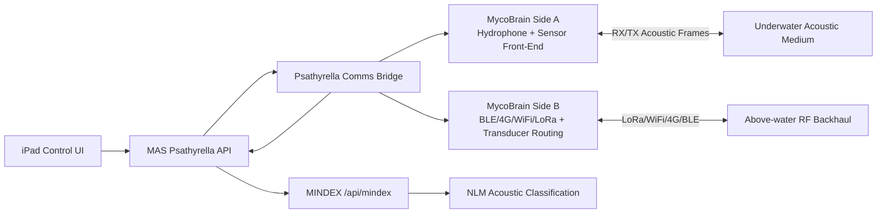

# Psathyrella Backend Architecture JUN25 2026

## Date
- June 25, 2026

## Status
- Active backend implementation baseline for MAS + MycoBrain firmware command routing.

## Scope
- Define MAS backend contract for Psathyrella control UI.
- Bridge radio and acoustic comms with store-and-forward behavior.
- Integrate acoustic ingest with MINDEX TAC-O observations and NLM acoustic classification.
- Define Side A vs Side B hardware responsibility for marine comms.

## API Contract (MAS)

Base URL: `http://localhost:8001`

| Endpoint | Method | Purpose | Notes |
|---|---|---|---|
| `/api/psathyrella/{device_id}/status` | GET | Aggregated buoy status | Proxies real device telemetry via MAS device registry |
| `/api/psathyrella/{device_id}/propulsion` | POST | Thruster vector/PWM command dispatch | Forwards to device command channel (`psa_thruster_vector_set` / `psa_thruster_pwm_set`) |
| `/api/psathyrella/{device_id}/waypoints` | POST | Waypoint CRUD (list/replace/append/upsert/delete/clear) | Redis-backed v1 working memory store |
| `/api/psathyrella/{device_id}/point-camera` | POST | Camera tower bearing/pitch hold command | Updates autonomy state and emits `psa_camera_point` |
| `/api/psathyrella/{device_id}/comms` | GET | Comms bridge/radio state | Includes queue depth and Side A/Side B recommendation |
| `/api/psathyrella/{device_id}/comms` | POST | Comms mode updates + frame ingest/flush | Supports `set_mode`, `ingest_radio`, `ingest_acoustic`, `flush_store_forward`, `set_backhaul` |
| `/api/psathyrella/{device_id}/acoustic/stream` | GET | SSE stream for acoustic ingest events | Emits ingest/classification/observation events + keepalive |
| `/api/psathyrella/{device_id}/vision/{camera\|lidar\|radar\|wifi}` | GET | Vision stream metadata/URL lookup | Uses env + registry `extra.vision_urls`; radar defaults to BlueSight stream |
| `/api/psathyrella/{device_id}/autonomy` | GET | Adapter-facing autonomy snapshot | Exposes mode, active waypoint, camera target, signal-follow mode |
| `/api/psathyrella/{device_id}/autonomy/signal-follow` | POST | Set signal follow mode | Uses `SignalFollowMode` enum (`acoustic`, `rf`, `optical`, `hybrid`) |

## Comms Architecture

## Side A vs Side B Recommendation

### Side A (recommended)
- Hydrophone capture and low-noise analog front-end.
- Local sensor fusion packet generation (acoustic metadata + environmental context).
- Thruster/actuator safety telemetry uplink.

### Side B (recommended)
- Radio stack ownership (BLE/4G/WiFi/LoRa).
- Acoustic transducer routing/orchestration for air-water bridge behavior.
- Store-and-forward queue control and backhaul flush logic.

### Rationale
- Keeps analog hydrophone path close to acquisition hardware.
- Consolidates radio and bridge arbitration on Side B where transport logic already exists.
- Matches existing Side B role as gateway-facing command router.

## MINDEX + SINE + NLM Integration

### Current wiring
- Acoustic events from MAS comms ingest are forwarded to:
  - `POST /api/mindex/nlm/classify/acoustic`
  - `POST /api/mindex/taco/observations`
- When classification is unavailable, MAS returns structured `status: pending` responses (no synthetic outputs).

### SINE path note
- SINE blob analysis endpoints require `blob_id` context (`/api/mindex/sine/blobs/{blob_id}/analyze`).
- Live hydrophone-to-blob ingestion remains an integration step for full end-to-end SINE wave analysis.

## Jetson / BlueSight / Integration Checklist

- [ ] Configure `PSATHYRELLA_CAMERA_STREAM_URL`
- [ ] Configure `PSATHYRELLA_LIDAR_STREAM_URL`
- [ ] Configure `PSATHYRELLA_RADAR_STREAM_URL` (or verify BlueSight stream route)
- [ ] Configure `PSATHYRELLA_WIFI_STREAM_URL`
- [ ] Ensure `MINDEX_API_URL` resolves to VM 189 (`http://192.168.0.189:8000`)
- [ ] Ensure MINDEX key/token env is present for MAS (`MINDEX_API_KEY` or `MINDEX_INTERNAL_TOKEN`)
- [ ] Validate `POST /api/mindex/nlm/classify/acoustic` reachable from MAS
- [ ] Validate `POST /api/mindex/taco/observations` reachable from MAS
- [ ] Jetson Blackwell mission adapter: map autonomy output to MycaControl/AgaricFlight command bus

## Firmware Command Surface Added

### Side A command names
- `psa_thruster_vector_set`
- `psa_thruster_pwm_set`
- `psa_transducer_aotx`
- `psa_transducer_optx`
- `psa_hydrophone_record`
- `psa_solar_read`
- `psa_gps_passthrough`
- `psa_camera_point`

### Side B command names
- `psb_comms_route_set`
- `psb_bridge_status`
- `psb_acoustic_forward`

## Known Gaps

- True underwater transducer RX/TX hardware driver path is still hardware-dependent (current firmware provides command interface + telemetry state, not full DSP modem stack).
- GPS passthrough currently stores/relays supplied NMEA payloads; direct GNSS UART parsing on Side A is pending board-level integration.
- Thruster command handling is interface-complete but still requires final ESC calibration profile per buoy.
