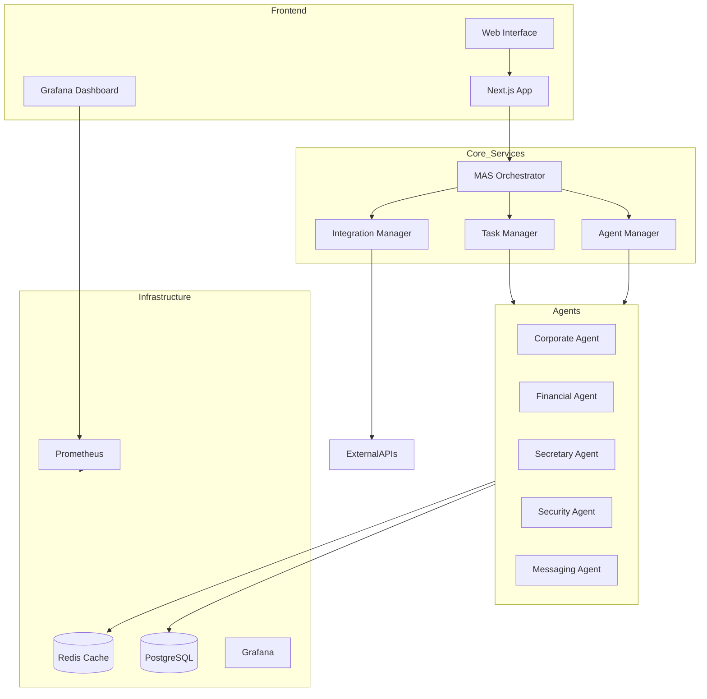

# Mycosoft MAS System Map

## System Architecture Overview



## Directory Structure

### Core System Components
```
mycosoft_mas/
├── agents/                  # Agent implementations
│   ├── clusters/           # Agent clustering logic
│   ├── corporate/          # Corporate operations agents
│   ├── financial/          # Financial management agents
│   ├── messaging/          # Communication agents
│   ├── secretary/          # Administrative agents
│   └── security/           # Security and access control agents
├── core/                   # Core system functionality
│   └── routers/           # API routing logic
├── services/               # Service implementations
│   └── maintenance/       # System maintenance services
└── integrations/          # External service connectors
```

### Frontend Components
```
app/                        # Next.js application
├── components/            # React components
│   └── ui/               # UI component library
├── styles/               # CSS and styling
└── public/               # Static assets
```

### Configuration and Infrastructure
```
config/                     # Configuration files
├── agent_configs/         # Agent-specific configs
└── system_configs/        # System-wide configs

docker/                     # Docker configurations
├── postgres/             # PostgreSQL setup
└── redis/                # Redis setup

grafana/                   # Monitoring
├── dashboards/           # Custom dashboards
└── provisioning/         # Grafana configuration

prometheus/                # Metrics
└── rules/                # Alert rules
```

### Data Management
```
data/
├── board/                # Board management data
├── communication/        # Communication logs
├── corporate/            # Corporate data
├── financial/           # Financial records
├── fungal_knowledge/    # Mycological database
├── ip/                  # Intellectual property
├── knowledge/           # General knowledge base
├── legal/              # Legal documentation
├── marketing/          # Marketing materials
├── messaging/          # Message archives
├── mycology/           # Mycological research
└── opportunities/      # Business opportunities
```

## Service Ports and Endpoints

### Core Services
- Web Interface: `:3000`
- MAS Orchestrator: `:8001`
- Grafana Dashboard: `:3002`
- Prometheus: `:9090`
- PostgreSQL: `:5432`
- Redis: `:6379`

### API Endpoints

#### System Management
- `/api/health` - System health check
- `/api/metrics` - Prometheus metrics
- `/api/status` - Service status

#### Agent Operations
- `/api/agents/list` - List active agents
- `/api/agents/tasks` - Agent task management
- `/api/agents/status` - Agent status monitoring

#### Data Management
- `/api/data/query` - Data query interface
- `/api/data/store` - Data storage
- `/api/data/analyze` - Data analysis

#### Integration Points
- `/api/integrations/status` - Integration status
- `/api/integrations/connect` - Connection management
- `/api/integrations/sync` - Data synchronization

## Dependencies

### Backend Dependencies
- FastAPI
- SQLAlchemy
- Redis-py
- Celery
- Pydantic
- PyTorch
- TensorFlow
- LangChain
- CrewAI

### Frontend Dependencies
- Next.js 14
- React 18
- TypeScript
- Tailwind CSS
- Shadcn UI
- Radix UI
- React Query

### Infrastructure Dependencies
- Docker
- Docker Compose
- Poetry
- Node.js
- PostgreSQL
- Redis
- Prometheus
- Grafana

## Monitoring and Metrics

### System Metrics
- Agent Performance
- Task Completion Rates
- Response Times
- Error Rates
- Resource Usage

### Business Metrics
- Transaction Volume
- Processing Time
- Success Rates
- Integration Status

### Dashboard Views
1. System Overview
   - Service Health
   - Agent Status
   - Resource Usage

2. Agent Performance
   - Task Distribution
   - Success Rates
   - Response Times

3. Data Analytics
   - Processing Metrics
   - Storage Usage
   - Query Performance

4. Integration Status
   - Connection Health
   - Sync Status
   - Error Rates

## Security and Access Control

### Authentication Methods
- JWT Token Authentication
- API Key Authentication
- OAuth2 Integration

### Authorization Levels
1. System Administrator
2. Agent Manager
3. Data Analyst
4. Integration Manager
5. Monitoring User

### Security Measures
- End-to-end Encryption
- Rate Limiting
- IP Whitelisting
- Audit Logging

## Backup and Recovery

### Backup Systems
- Database Backups
- Configuration Backups
- Log Archives

### Recovery Procedures
1. Service Recovery
2. Data Recovery
3. System State Recovery

## Development Tools

### Required Tools
- VS Code / PyCharm
- Docker Desktop
- Git
- Poetry
- Node.js
- Python 3.11

### Testing Tools
- PyTest
- Jest
- Cypress
- Postman

### Monitoring Tools
- Grafana
- Prometheus
- ELK Stack
- Custom Dashboards

## License and Compliance

- Proprietary Software
- All Rights Reserved
- © Morgan Rockwell 