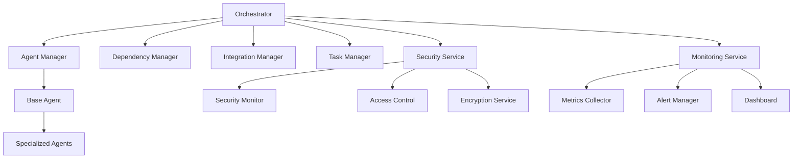
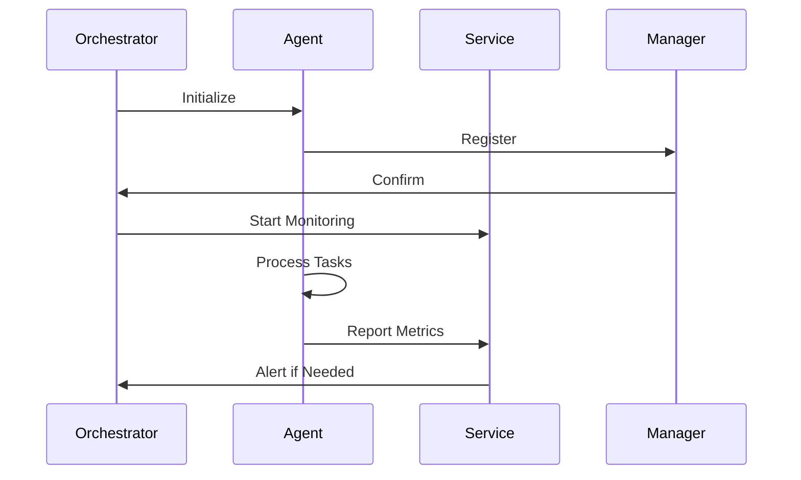
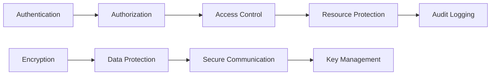
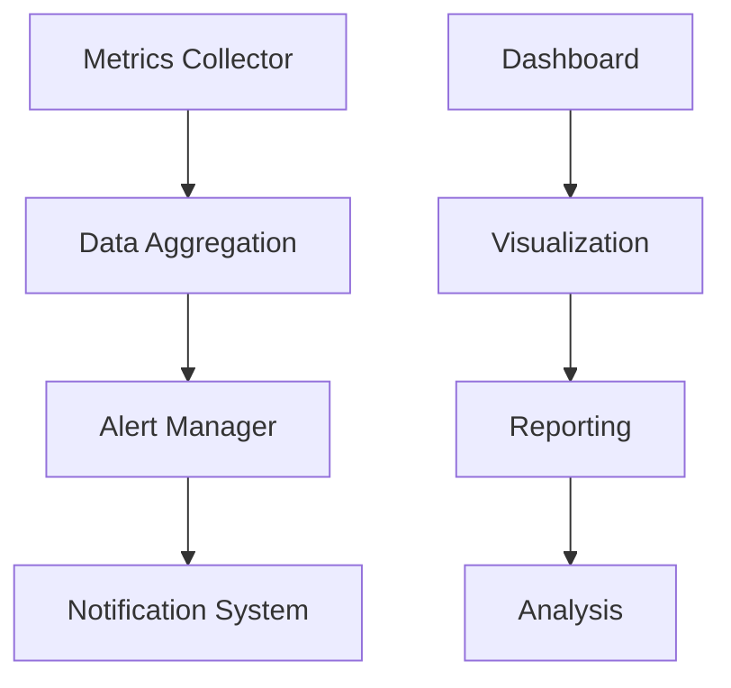
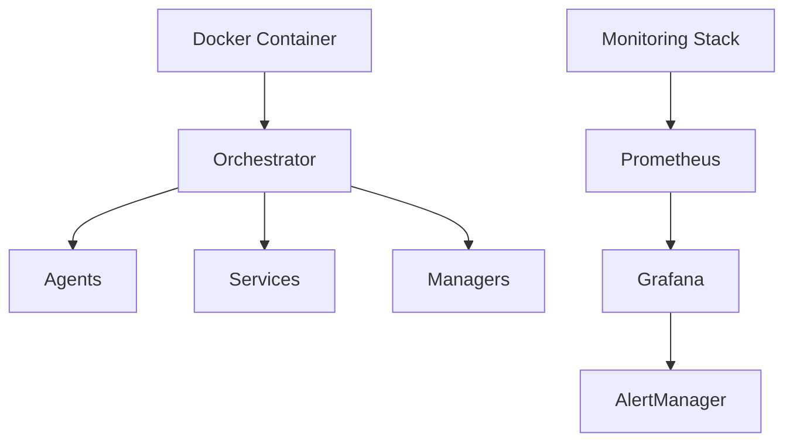

# Mycosoft MAS Architecture Documentation

## System Overview

The Mycosoft Multi-Agent System (MAS) is a sophisticated framework designed for managing complex interactions between specialized agents. The system follows a hierarchical architecture with clear separation of concerns.

## Architecture Diagram

## Core Components

### 1. Orchestrator
- Central coordination point for the entire system
- Manages agent lifecycle and interactions
- Handles system-wide security and monitoring
- Coordinates between different managers

### 2. Agent System
- Base Agent: Core functionality and communication
- Specialized Agents: Domain-specific implementations
- Agent Manager: Lifecycle and coordination
- Messaging System: Inter-agent communication

### 3. Service Layer
- Security Service: Authentication and authorization
- Monitoring Service: System health and metrics
- Integration Service: External system connections
- Evolution Monitor: Technology tracking
- Technology Tracker: Version and compatibility

### 4. Management Layer
- Dependency Manager: Package and version control
- Integration Manager: External system connections
- Task Manager: Workflow and process management

## Communication Flow

## Security Architecture

## Monitoring Architecture

## Integration Points

1. **External Systems**
   - REST APIs
   - WebSocket Connections
   - Database Integration
   - File System Access

2. **Internal Integration**
   - Inter-agent Communication
   - Service-to-Service Calls
   - Manager Coordination
   - Event Handling

## Deployment Architecture

## Configuration Management

1. **Configuration Files**
   - System-wide settings
   - Agent-specific configurations
   - Service parameters
   - Security policies

2. **Environment Variables**
   - Deployment settings
   - Security credentials
   - Service endpoints

## Error Handling

1. **Exception Hierarchy**
   - System-level exceptions
   - Agent-specific exceptions
   - Service exceptions
   - Integration exceptions

2. **Recovery Mechanisms**
   - Automatic retry
   - Fallback procedures
   - State recovery
   - Logging and alerting

## Performance Considerations

1. **Scaling**
   - Horizontal agent scaling
   - Service replication
   - Load balancing
   - Resource optimization

2. **Optimization**
   - Message batching
   - Caching strategies
   - Resource pooling
   - Connection management

## Development Guidelines

1. **Code Organization**
   - Modular design
   - Clear interfaces
   - Documentation standards
   - Testing requirements

2. **Best Practices**
   - Security first
   - Performance optimization
   - Error handling
   - Logging standards 